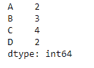
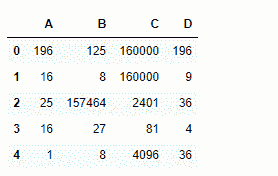
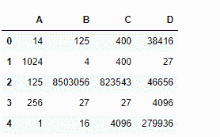

# python | pandas data frame . pow()

> 原文:[https://www.geeksforgeeks.org/python-pandas-dataframe-pow/](https://www.geeksforgeeks.org/python-pandas-dataframe-pow/)

Python 是进行数据分析的优秀语言，主要是因为以数据为中心的 python 包的奇妙生态系统。 ***【熊猫】*** 就是其中一个包，让导入和分析数据变得容易多了。

熊猫 `**dataframe.pow()**`函数计算数据帧和其他元素的指数幂(二进制运算符幂)。该功能本质上与`dataframe ** other`相同，但支持填充一个输入数据中的缺失值。

> **语法:** DataFrame.pow(其他，轴= '列'，级别=无，fill _ value =无)
> 
> **参数:**
> **其他:**系列、数据帧或常数
> **轴:**对于系列输入，要匹配系列索引的轴在
> **级别:**跨级别广播，匹配传递的多索引级别上的索引值
> **fill_value :** 填充现有的缺失(NaN)值，以及成功的数据帧对齐所需的任何新元素，在计算前使用该值。如果两个相应数据框位置的数据都丢失，结果也将丢失。
> ****kwargs :** 其他关键字参数被传递到 DataFrame.shift 或 Series.shift 中。
> 
> **返回:**结果:数据帧

**示例#1:** 使用`pow()`函数查找数据框中每个元素的幂。使用数列将一行中的每个元素提升到不同的幂。

```py
# importing pandas as pd
import pandas as pd

# Creating the dataframe 
df1 = pd.DataFrame({"A":[14, 4, 5, 4, 1],
                    "B":[5, 2, 54, 3, 2],
                    "C":[20, 20, 7, 3, 8],
                    "D":[14, 3, 6, 2, 6]})

# Print the dataframe
df
```


让我们创建一个系列

```py
# importing pandas as pd
import pandas as pd

# Create the Series
sr = pd.Series([2, 3, 4, 2], index =["A", "B", "C", "D"])

# Print the series
sr
```



现在，让我们使用`dataframe.pow()`函数将一行中的每个元素提升到不同的幂。

```py
# find the power
df.pow(sr, axis = 1)
```

**输出:**


**示例 2:** 使用`pow()`函数将第一个数据帧的每个元素提升到另一个数据帧中相应元素的幂。

```py
# importing pandas as pd
import pandas as pd

# Creating the first dataframe 
df1 = pd.DataFrame({"A":[14, 4, 5, 4, 1],
                    "B":[5, 2, 54, 3, 2], 
                    "C":[20, 20, 7, 3, 8],
                    "D":[14, 3, 6, 2, 6]})

# Creating the second dataframe
df2 = pd.DataFrame({"A":[1, 5, 3, 4, 2],
                    "B":[3, 2, 4, 3, 4],
                    "C":[2, 2, 7, 3, 4],
                    "D":[4, 3, 6, 12, 7]})

# using pow() function to raise each element
# in df1 to the power of corresponding element in df2
df1.pow(df2)
```

**输出:**
