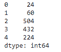
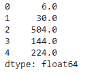

# Python | Pandas data frame . product()

> 原文:[https://www . geesforgeks . org/python-pandas-data frame-product/](https://www.geeksforgeeks.org/python-pandas-dataframe-product/)

Python 是进行数据分析的优秀语言，主要是因为以数据为中心的 python 包的奇妙生态系统。 ***【熊猫】*** 就是其中一个包，让导入和分析数据变得容易多了。

熊猫 `**dataframe.product()**`功能返回所请求坐标轴的产品值。它在请求的轴上将所有元素相乘。默认情况下，选择索引轴。

> **语法:**data frame . product(axis =无，skipna =无，level =无，numeric _ only =无，min_count=0，**kwargs)
> 
> **参数:**
> **轴:**{索引(0)，列(1)}
> **skipna :** 计算结果时排除 NA/null 值。
> **级别:**如果轴是多索引(分层的)，沿特定级别计数，折叠成系列
> **仅限数值:**仅包括浮点、int 和布尔列。如果没有，将尝试使用所有内容，然后只使用数字数据。不适用于系列。
> **min_count :** 执行操作所需的有效值数量。如果存在少于最小计数的非数值，结果将为“不适用”。
> 
> **返回:**生产:系列或数据帧(如果指定了级别)

**示例#1:** 使用`product()`函数查找数据框中列轴上所有元素的乘积。

```
# importing pandas as pd
import pandas as pd

# Creating the dataframe 
df = pd.DataFrame({"A":[1, 5, 3, 4, 2], 
                   "B":[3, 2, 4, 3, 4], 
                   "C":[2, 2, 7, 3, 4], 
                   "D":[4, 3, 6, 12, 7]})

# Print the dataframe
df
```


让我们使用`dataframe.product()`函数找到数据框中每个元素在列轴上的乘积。

```
# find the product over the column axis
df.product(axis = 1)
```

**输出:**


**示例 2:** 使用`product()`函数查找数据框中任意轴的乘积。数据框包含`NaN`值。

```
# importing pandas as pd
import pandas as pd

# Creating the first dataframe 
df = pd.DataFrame({"A":[1, 5, 3, 4, 2],
                   "B":[3, None, 4, 3, 4], 
                   "C":[2, 2, 7, None, 4],
                   "D":[None, 3, 6, 12, 7]})

# using prod() function to raise each element
# in df1 to the power of corresponding element in df2
df.product(axis = 1, skipna = True)
```

**输出:**
