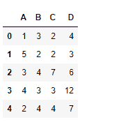
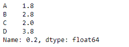
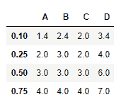

# python | pandas data frame . quantum le()

> 原文:[https://www . geesforgeks . org/python-pandas-data frame-quantile/](https://www.geeksforgeeks.org/python-pandas-dataframe-quantile/)

Python 是进行数据分析的优秀语言，主要是因为以数据为中心的 python 包的奇妙生态系统。 ***【熊猫】*** 就是其中一个包，让导入和分析数据变得容易多了。

Pandas `**dataframe.quantile()**`函数返回所请求轴上给定分位数的值，即一个数值百分比。

**注:**在将频率分布分成相等组的变量的任何一组值中，每个组包含总人口的相同部分。

> **语法:**数据帧分位数(q=0.5，轴=0，numeric_only=True，插值= '线性')
> 
> **参数:**
> **q :** 浮点或数组状，默认 0.5 (50%分位数)。0 < = q < = 1，计算
> **轴的分位数:** [{0，1，' index '，' columns'}(默认为 0)]行方向为 0 或' index '，列方向为 1 或' columns ' {仅限于
> **numeric_only :** 如果为 False，也将计算日期时间和时间增量数据的分位数
> **插值:** {“线性”、“较低”、“较高”、“中点”、“最近的”}
> 
> **返回:**分位数:序列或数据帧
> - >如果 q 是数组，将返回一个数据帧，其中索引是 q，列是自身的列，值是分位数。
> - >如果 q 是浮点数，将返回一个数列，其中索引是 self 的列，值是分位数。

**示例#1:** 使用`quantile()`函数找到“. 2”分位数的值

```
# importing pandas as pd
import pandas as pd

# Creating the dataframe 
df = pd.DataFrame({"A":[1, 5, 3, 4, 2],
                   "B":[3, 2, 4, 3, 4],
                   "C":[2, 2, 7, 3, 4], 
                   "D":[4, 3, 6, 12, 7]})

# Print the dataframe
df
```



让我们使用`dataframe.quantile()`函数来为数据帧中的每一列找到“. 2”的分位数

```
# find the product over the index axis
df.quantile(.2, axis = 0)
```

**输出:**


**示例#2:** 使用`quantile()`函数沿索引轴查找(. 1，. 25，. 5，. 75)个元素。

```
# importing pandas as pd
import pandas as pd

# Creating the dataframe 
df = pd.DataFrame({"A":[1, 5, 3, 4, 2],
                   "B":[3, 2, 4, 3, 4],
                   "C":[2, 2, 7, 3, 4],
                   "D":[4, 3, 6, 12, 7]})

# using quantile() function to
# find the quantiles over the index axis
df.quantile([.1, .25, .5, .75], axis = 0)
```

**输出:**
