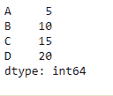
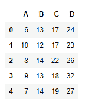
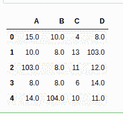

# python | pandas data frame . radd()

> 哎哎哎:# t0]https://www . geeksforgeeks . org/python 熊猫 dataframe-radd/

Python 是进行数据分析的优秀语言，主要是因为以数据为中心的 python 包的奇妙生态系统。 ***【熊猫】*** 就是其中一个包，让导入和分析数据变得容易多了。
熊猫**数据框. radd()** 功能执行数据框和其他对象元素的添加。其他对象可以是常量、序列或数据帧。该函数本质上执行 other + dataframe，但额外支持 fill_value，它会填充其中一个输入中的所有缺失值。
对于序列输入，索引必须匹配。
**注:**这与 dataframe.add()函数不同。在这个函数中，我们将数据框添加到另一个对象中。

> **语法:** DataFrame.radd(other，axis='columns '，level=None，fill_value=None)
> **参数:**
> **other :** Series，DataFrame，或常量
> **axis :** 对于 Series 输入，axis 要匹配
> **级别上的 Series 索引:**跨级别广播，匹配传递的 MultiIndex 级别上的索引值
> **fill_value :** 填充现有如果两个相应数据框位置的数据都丢失，结果将丢失
> **返回:**结果:数据框

**示例#1:** 使用 radd()函数将数据框与一系列
相加

## 蟒蛇 3

```
# importing pandas as pd
import pandas as pd

# Creating the dataframe
df = pd.DataFrame({"A":[1, 5, 3, 4, 2],
                   "B":[3, 2, 4, 3, 4],
                   "C":[2, 2, 7, 3, 4],
                   "D":[4, 3, 6, 12, 7]})

# Print the dataframe
df
```


让我们创建一个与数据框列轴的索引相匹配的系列

## 蟒蛇 3

```
# importing pandas as pd
import pandas as pd

# Create a Series
sr = pd.Series([5, 10, 15, 20], index =["A", "B", "C", "D"])

# Print the series
sr
```



现在，使用 dataframe.radd()函数执行加法。

## 蟒蛇 3

```
# add dataframe to the series over the column axis
df.radd(sr, axis = 1)
```

**输出:**



**示例 2:** 使用 radd()函数逐元素添加两个数据框

## 蟒蛇 3

```
# importing pandas as pd
import pandas as pd

# Creating the first dataframe
df1 = pd.DataFrame({"A":[1, 5, 3, 4, 2],
                    "B":[3, 2, 4, 3, 4],
                    "C":[2, 2, 7, 3, 4],
                    "D":[4, 3, 6, 12, 7]})

# Creating the second dataframe
df2 = pd.DataFrame({"A":[14, 5, None, 4, 12],
                    "B":[7, 6, 4, 5, None],
                    "C":[2, 11, 4, 3, 6],
                    "D":[4, None, 6, 2, 4]})

# add two dataframes
df1.radd(df2, fill_value = 100)
```

**输出:**

