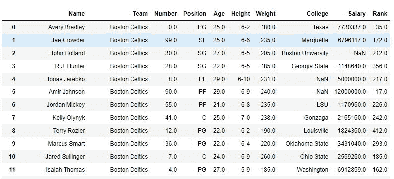
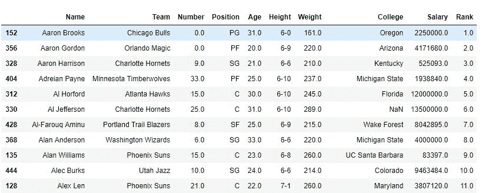
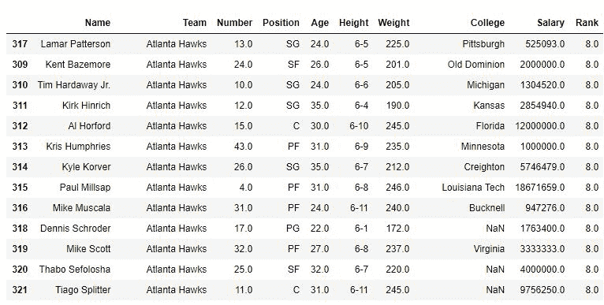
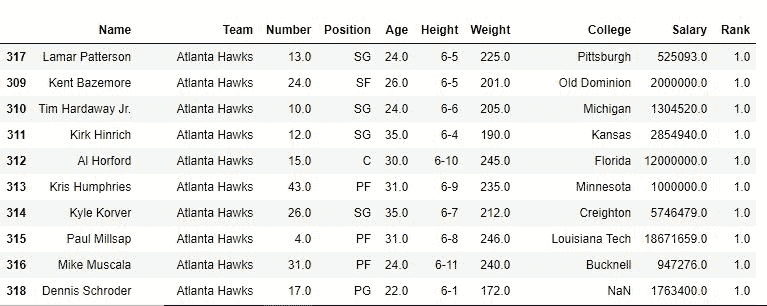

# Python | Pandas data frame . rank()

> 原文:[https://www.geeksforgeeks.org/python-pandas-dataframe-rank/](https://www.geeksforgeeks.org/python-pandas-dataframe-rank/)

Python 是进行数据分析的优秀语言，主要是因为以数据为中心的 python 包的奇妙生态系统。 ***【熊猫】*** 就是其中一个包，让导入和分析数据变得容易多了。

熊猫 **`Dataframe.rank()`** 方法返回一系列传递的每个相应指数的等级。排序后根据位置返回排名。

> **`Syntax:`**
> data frame . rank(axis = 0，method='average '，numeric_only=None，na_option='keep '，升序=True，pct=False)
> 
> `**Parameters:**`
> **轴:**行为 0 或“索引”，列为 1 或“列”。
> **方法:**取一个字符串输入(‘平均’‘最小’‘最大’‘第一’‘密集’)，告诉熊猫用相同的值做什么。默认值为平均值，这意味着将等级的平均值分配给相似的值。
> **numeric_only:** 取一个布尔值，rank 函数只在为 False 时对非数值有效。
> **na_option:** 采用 3 个字符串输入(“保留”、“顶部”、“底部”)来设置空值在传递的序列中的位置(如果有)。
> **升序:**布尔值，如果为真，则按升序排列。
> **pct:** 布尔值，如果为真，则按百分比排序。
> 
> `**Return type:**` 来电序列各指标排名的序列。

有关代码中使用的 CSV 文件的链接，请单击此处的[。](https://media.geeksforgeeks.org/wp-content/uploads/nba.csv)

**示例#1:** 具有唯一值的排名列

在下面的示例中，创建了一个新的排名列，对每个玩家的姓名进行排名。*名称*列中的所有值都是唯一的，因此不需要描述方法。

```
# importing pandas package
import pandas as pd

# making data frame from csv file
data = pd.read_csv("nba.csv")

# creating a rank column and passing the returned rank series
data["Rank"] = data["Name"].rank()

# display
data

# sorting w.r.t name column
data.sort_values("Name", inplace = True)

# display after sorting w.r.t Name column
data
```

**输出:**
如图所示，创建了一个列排名，每个名称的排名。在 sort_value 函数根据名称对数据框进行排序后，可以看到排名也进行了排序，因为这些只是名称的排名。

**排序前–**


**排序后–**


**示例#2:** 排序列有一些相似的值

在下面的例子中，数据帧首先根据*队名*进行排序，并且首先该方法是默认的(即平均)，因此同一队球员的排名是平均的。之后，min 方法也用于查看输出。

```
# importing pandas package
import pandas as pd

# making data frame from csv file
data = pd.read_csv("nba.csv")

# sorting w.r.t team name
data.sort_values("Team", inplace = True)

# creating a rank column and passing the returned rank series
# change method to 'min' to rank by minimum
data["Rank"] = data["Team"].rank(method ='average')

# display
data
```

**输出:**

***同法=***


***同法=【min】***
