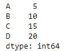
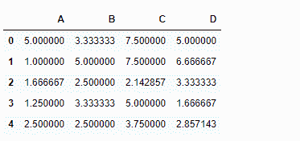
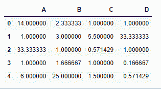

# python | pandas data frame . rdiv()

> 哎哎哎:# t0]https://www . geeksforgeeks . org/python 熊猫 dataframe-rdiv/

Python 是进行数据分析的优秀语言，主要是因为以数据为中心的 python 包的奇妙生态系统。 ***【熊猫】*** 就是其中一个包，让导入和分析数据变得容易多了。

熊猫 `**dataframe.rdiv()**`函数计算数据帧和其他元素的浮点除法(二进制运算符 rtruediv)。其他对象可以是标量、熊猫系列或熊猫数据帧。该功能本质上与执行`other / dataframe`相同，但支持用 fill_value 替换其中一个输入中缺失的数据。

> **语法:** DataFrame.rdiv(其他，轴= '列'，级别=无，fill _ value =无)
> 
> **参数:**
> **其他:**系列、数据帧或常量
> **轴:**对于系列输入，要匹配系列索引的轴在
> **级别:**跨级别广播，匹配传递的多索引级别上的索引值
> **仅数值 _ 仅:**仅包括浮点、int、布尔数据。仅适用于数据框或面板对象
> **fill_value :** 填充现有的缺失(NaN)值，以及成功的数据框对齐所需的任何新元素，计算前使用该值。如果两个相应数据框位置中的数据都丢失，则结果也将丢失
> 
> **返回:**结果:数据帧

**示例#1:** 使用`rdiv()`函数以数据帧元素的方式划分一个系列

```py
# importing pandas as pd
import pandas as pd

# Creating the dataframe 
df = pd.DataFrame({"A":[1, 5, 3, 4, 2],
                   "B":[3, 2, 4, 3, 4], 
                   "C":[2, 2, 7, 3, 4],
                   "D":[4, 3, 6, 12, 7]})

# Print the dataframe
df
```


让我们创建一个系列

```py
# importing pandas as pd
import pandas as pd

# Create a series
sr = pd.Series([5, 10, 15, 20], index =["A", "B", "C", "D"])

# Print the series
sr
```



让我们使用`dataframe.rdiv()`函数用一个数据帧来划分序列

```py
# perform division of series with 
# dataframe element-wise over the column axis
df.rdiv(sr, axis = 1)
```

**输出:**


**示例 2:** 使用`rdiv()`函数将一个数据帧与另一个包含`NaN`值的数据帧相除。

```py
# importing pandas as pd
import pandas as pd

# Creating the first dataframe 
df1 = pd.DataFrame({"A":[1, 5, 3, 4, 2],
                    "B":[3, 2, 4, 3, 4], 
                    "C":[2, 2, 7, 3, 4],
                    "D":[4, 3, 6, 12, 7]})

# Creating the second dataframe
df2 = pd.DataFrame({"A":[14, 5, None, 4, 12],
                    "B":[7, 6, 4, 5, None],
                    "C":[2, 11, 4, 3, 6], 
                    "D":[4, None, 6, 2, 4]})

# divide df2 by df1 element-wise
# Fill all the missing values by 100
df1.rdiv(df2, fill_value = 100)
```

**输出:**
