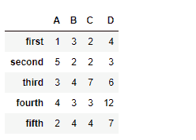
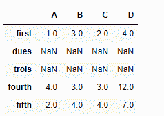
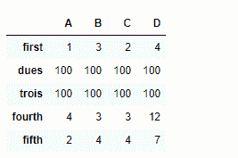
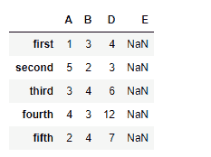
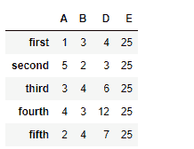

# python | pandas data frame . reindex()

> 原文:[https://www . geesforgeks . org/python-pandas-data frame-rein dex/](https://www.geeksforgeeks.org/python-pandas-dataframe-reindex/)

Python 是进行数据分析的优秀语言，主要是因为以数据为中心的 python 包的奇妙生态系统。 ***【熊猫】*** 就是其中一个包，让导入和分析数据变得容易多了。

Pandas `**dataframe.reindex()**`函数通过可选的填充逻辑使数据帧符合新索引，将 NA/NaN 放在先前索引中没有值的位置。除非新索引等同于当前索引并且 copy=False，否则将生成一个新对象

> **语法:** DataFrame.reindex(标签=无，索引=无，列=无，轴=无，方法=无，复制=真，级别=无，fill_value=nan，限制=无，容差=无)
> 
> **参数:**
> **标签:**新标签/索引要符合‘轴’指定的轴到。
> **索引，列:**要符合的新标签/索引。最好是一个索引对象，以避免复制数据
> **轴:**轴到目标。可以是轴名(“索引”、“列”)或数字(0，1)。
> **方法:** {None，'回填'/'bfill '，' pad'/'ffill '，'最近' }，可选
> **复制:**返回新对象，即使传递的索引相同
> **级别:**跨级别广播，匹配传递的多索引级别上的索引值
> **fill_value :** 填充现有的缺失(NaN)值，以及成功的数据帧对齐所需的任何新元素，在计算前使用该值。如果两个相应数据框位置的数据都丢失，结果也将丢失。
> **限制:**向前或向后填充的连续元素的最大数量
> **公差:**不精确匹配的原始标签和新标签之间的最大距离。匹配位置的索引值最符合方程式 abs(索引[步进器]–目标)< =公差。
> 
> **返回:**重新索引:数据帧

**示例#1:** 使用`reindex()`功能重新索引数据帧。默认情况下，新索引中在 dataframe 中没有相应记录的值被分配给 NaN。
**注意:**我们可以通过向关键字 fill_value 传递一个值来填充缺失的值。

```py
# importing pandas as pd
import pandas as pd

# Creating the dataframe 
df = pd.DataFrame({"A":[1, 5, 3, 4, 2],
                   "B":[3, 2, 4, 3, 4],
                   "C":[2, 2, 7, 3, 4],
                   "D":[4, 3, 6, 12, 7]},
                   index =["first", "second", "third", "fourth", "fifth"])

# Print the dataframe
df
```



让我们使用`dataframe.reindex()`函数来重新索引数据帧

```py
# reindexing with new index values
df.reindex(["first", "dues", "trois", "fourth", "fifth"])
```

**输出:**

注意输出，新的索引填充了`NaN`值，我们可以使用参数 fill_value 来填充缺失的值

```py
# filling the missing values by 100
df.reindex(["first", "dues", "trois", "fourth", "fifth"], fill_value = 100)
```

**输出:**


**示例 2:** 使用`reindex()`功能重新索引列轴

```py
# importing pandas as pd
import pandas as pd

# Creating the first dataframe 
df1 = pd.DataFrame({"A":[1, 5, 3, 4, 2],
                    "B":[3, 2, 4, 3, 4],
                    "C":[2, 2, 7, 3, 4],
                    "D":[4, 3, 6, 12, 7]})

# reindexing the column axis with
# old and new index values
df.reindex(columns =["A", "B", "D", "E"])
```

**输出:**

注意，我们在重新索引后的新列中有`NaN`值，我们可以在重新索引时处理丢失的值。通过向函数传递参数`fill_value` 。

```py
# reindex the columns
# fill the missing values by 25
df.reindex(columns =["A", "B", "D", "E"], fill_value = 25)
```

**输出:**
