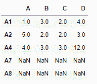
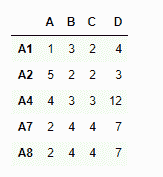
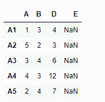
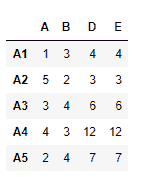

# Python | Pandas data frame . reindex _ axis()

> 原文:[https://www . geesforgeks . org/python-pandas-data frame-rein dex _ axis/](https://www.geeksforgeeks.org/python-pandas-dataframe-reindex_axis/)

Python 是进行数据分析的优秀语言，主要是因为以数据为中心的 python 包的奇妙生态系统。 ***【熊猫】*** 就是其中一个包，让导入和分析数据变得容易多了。

熊猫 `**dataframe.reindex_axis()**`功能使输入对象符合新的索引。该函数在先前索引中没有值的位置填充`NaN`值。它还提供了一种填充数据框中缺失值的方法。除非新索引等同于当前索引并且 copy=False，否则将生成一个新对象

> **语法:**
> **语法:** DataFrame.reindex_axis(标签，axis=0，方法=无，级别=无，复制=真，限制=无，fill_value=nan)
> 
> **参数:**
> **标签:**新标签/索引要符合。最好是一个 Index 对象，以避免重复数据
> **轴:** {0 或‘Index’，1 或‘columns’}
> **方法:** {None，【回填】/“bfill”，“pad”/“ffill”，“最近的”}，可选的
> **复制:**返回一个新的对象，即使传递的索引是相同的
> **级别:**跨级别广播，匹配传递的多索引级别上的索引值
> **限制:【1】匹配位置的索引值最符合方程式 abs(索引[步进器]–目标)< =公差。**
> 
> **返回:**重新索引:数据帧

**示例#1:** 使用`reindex_axis()`函数在索引轴上重新索引数据框。默认情况下，新索引中在 dataframe 中没有相应记录的值被分配给 NaN。
**注:**我们可以使用‘ffill’方法填写缺失值

```py
# importing pandas as pd
import pandas as pd

# Creating the dataframe 
df = pd.DataFrame({"A":[1, 5, 3, 4, 2], 
                   "B":[3, 2, 4, 3, 4],
                   "C":[2, 2, 7, 3, 4],
                   "D":[4, 3, 6, 12, 7]},
                   index =["A1", "A2", "A3", "A4", "A5"])

# Print the dataframe
df
```


让我们使用`dataframe.reindex_axis()`函数在索引轴上重新索引数据帧

```py
# reindexing with new index values
df.reindex_axis(["A1", "A2", "A4", "A7", "A8"], axis = 0)
```

**输出:**

注意输出，新的索引填充了`NaN`值，我们可以使用‘ffill’方法来填充缺失的值。

```py
# filling the missing values using ffill method
df.reindex_axis(["A1", "A2", "A4", "A7", "A8"], 
                     axis = 0, method ='ffill')
```

**输出:**

注意在输出中，新的索引已经使用“A5”行填充。

**示例 2:** 使用`reindex_axis()`功能重新索引列轴

```py
# importing pandas as pd
import pandas as pd

# Creating the dataframe 
df = pd.DataFrame({"A":[1, 5, 3, 4, 2],
                   "B":[3, 2, 4, 3, 4],
                   "C":[2, 2, 7, 3, 4],
                   "D":[4, 3, 6, 12, 7]}, 
                   index =["A1", "A2", "A3", "A4", "A5"])

# reindexing the column axis with
# old and new index values
df.reindex_axis(["A", "B", "D", "E"], axis = 1)
```

**输出:**


请注意，我们在重新索引后的新列中有`NaN`值，我们可以在重新索引时处理丢失的值。通过使用`ffill` 方法，我们可以向前填充缺失的值。

```py
# reindex the columns
# we fill the missing values using ffill method
df.reindex_axis(["A", "B", "D", "E"], axis = 1, method ='ffill')
```

**输出:**
