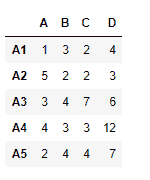
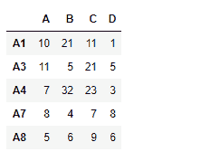
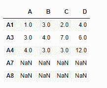
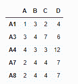
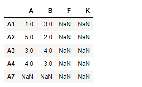
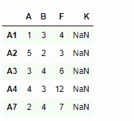

# Python | Pandas data frame . reindex _ like()

> 原文:[https://www . geesforgeks . org/python-pandas-data frame-rein dex _ like/](https://www.geeksforgeeks.org/python-pandas-dataframe-reindex_like/)

Python 是进行数据分析的优秀语言，主要是因为以数据为中心的 python 包的奇妙生态系统。 ***【熊猫】*** 就是其中一个包，让导入和分析数据变得容易多了。

熊猫 `**dataframe.reindex_like()**`函数返回一个匹配索引的对象给自己。任何不匹配的索引都用`NaN`值填充。

> **语法:**
> **语法:** DataFrame.reindex_like(其他，方法=无，复制=真，限制=无，容差=无)
> 
> **参数:**
> **其他:**对象
> **方法:**字符串或无
> **副本:**布尔值，默认为真
> **限制:**不精确匹配要填充的最大连续标签数。
> **公差:**另一个对象的标签与该对象之间的最大距离，用于不精确匹配。可以是列表式的。
> 
> **返回:**重新索引:与输入相同

**示例#1:** 使用`reindex_like()`函数找到给定两个数据帧之间的匹配索引。

**注意:**我们可以使用任何一种填充方法(例如。ffill '，' bfill ')。

```py
# importing pandas as pd
import pandas as pd

# Creating the first dataframe 
df1 = pd.DataFrame({"A":[1, 5, 3, 4, 2],
                    "B":[3, 2, 4, 3, 4],
                    "C":[2, 2, 7, 3, 4],
                    "D":[4, 3, 6, 12, 7]},
                    index =["A1", "A2", "A3", "A4", "A5"])

# Creating the second dataframe
df2 = pd.DataFrame({"A":[10, 11, 7, 8, 5], 
                    "B":[21, 5, 32, 4, 6],
                    "C":[11, 21, 23, 7, 9], 
                    "D":[1, 5, 3, 8, 6]}, 
                     index =["A1", "A3", "A4", "A7", "A8"])

# Print the first dataframe
df1

# Print the second dataframe
df2
```




让我们使用`dataframe.reindex_like()`函数来查找匹配的索引。

```py
# find matching indexes
df1.reindex_like(df2)
```

**输出:**


注意输出，不匹配的索引用`NaN`值填充，我们可以用‘ffill’方法填充缺失的值。

```py
# filling the missing values using ffill method
df1.reindex_like(df2, method ='ffill')
```

**输出:**

注意在输出中，新的索引已经使用“A5”行填充。

**示例 2:** 使用`reindex_like()`函数匹配两个数据帧的索引，并限制填充缺失值。

```py
# importing pandas as pd
import pandas as pd

# Creating the first dataframe 
df1 = pd.DataFrame({"A":[1, 5, 3, 4, 2],
                    "B":[3, 2, 4, 3, 4],
                    "C":[2, 2, 7, 3, 4],
                    "D":[4, 3, 6, 12, 7]},
                    index =["A1", "A2", "A3", "A4", "A5"])

# Creating the second dataframe
df2 = pd.DataFrame({"A":[10, 11, 7, 8, 5],
                    "B":[21, 5, 32, 4, 6],
                    "F":[11, 21, 23, 7, 9],
                    "K":[1, 5, 3, 8, 6]},
                    index =["A1", "A2", "A3", "A4", "A7"])

# matching the indexes
df1.reindex_like(df2)
```

**输出:**

注意输出，不匹配的索引填充有`NaN`值，我们可以使用‘ffill’方法填充缺失的值。我们还限制了可以使用 limit 参数填充的连续不匹配索引的数量。

```py
# match the indexes
# fill the unmatched index using 'ffill' method
# maximum consecutive unmatched indexes to be filled is 1

df.reindex_like(df1, method ='ffill', limit = 1)
```

**输出:**
