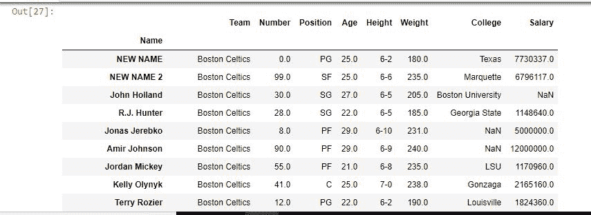

# Python | Pandas data frame . rename()

> 原文:[https://www . geesforgeks . org/python-pandas-data frame-rename/](https://www.geeksforgeeks.org/python-pandas-dataframe-rename/)

Python 是进行数据分析的优秀语言，主要是因为以数据为中心的 python 包的奇妙生态系统。 ***【熊猫】*** 就是其中一个包，让导入和分析数据变得容易多了。

熊猫 **`rename()`** 方法用于重命名任何索引、列或行。列的重命名也可以通过`dataframe.columns = [#list]`完成。但是在上面的情况下，没有太多的自由。即使必须更改一列，也必须传递完整的列列表。此外，上述方法不适用于索引标签。

> **语法:**数据框.重命名(映射器=无，索引=无，列=无，轴=无，复制=真，位置=假，级别=无)
> 
> **参数:**
> **映射器，索引及列:**字典值，键指旧名，值指新名。一次只能使用这些参数中的一个。
> **轴:** int 或 string 值，0/'row '代表 row，1/'columns '代表 columns。
> **复制:**如果为真，则复制底层数据。
> **在位:**如果为真，则对原始数据框进行更改。
> **级别:**用于指定数据帧有多级索引时的级别。
> 
> **返回类型:**新名称的数据框

要下载代码中使用的 CSV，点击这里的[。](https://media.geeksforgeeks.org/wp-content/uploads/nba.csv)

**示例#1:** 更改索引标签

在本例中，名称列被设置为索引列，稍后使用 rename()方法更改其名称。

```py
# importing pandas module
import pandas as pd

# making data frame from csv file
data = pd.read_csv("nba.csv", index_col ="Name" )

# changing index cols with rename()
data.rename(index = {"Avery Bradley": "NEW NAME",
                     "Jae Crowder":"NEW NAME 2"},
                                 inplace = True)
# display
data
```

**输出:**
如输出图像所示，第一和第二位置的索引标签名称被更改为新名称&新名称 2。


**示例#2:** 更改多个列名

在本例中，通过传递字典来更改多个列名。稍后将结果与使用返回的数据帧进行比较。列方法。在比较之前删除空值，因为 NaN==NaN 将返回 false。

```py
# importing pandas module
import pandas as pd

# making data frame from csv file
data = pd.read_csv("nba.csv", index_col ="Name" )

# changing cols with rename()
new_data = data.rename(columns = {"Team": "Team Name",
                                  "College":"Education",
                                  "Salary": "Income"})

# changing columns using .columns()
data.columns = ['Team Name', 'Number', 'Position', 'Age',
                'Height', 'Weight', 'Education', 'Income']

# dropna used to ignore na values
print(new_data.dropna()== data.dropna())
```

**输出:**
如输出图像所示，由于所有值都为真，因此两种方式的结果相同。
