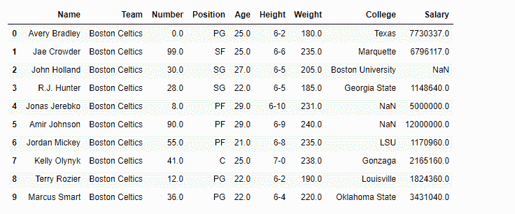
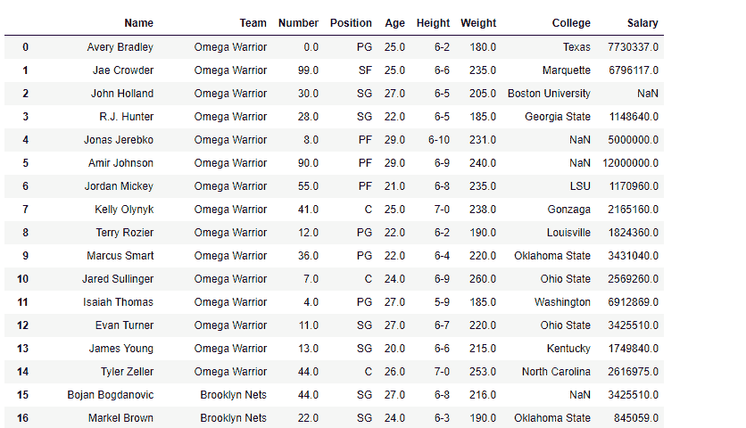
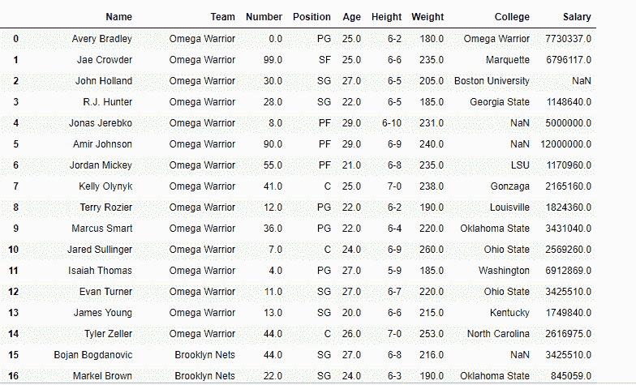
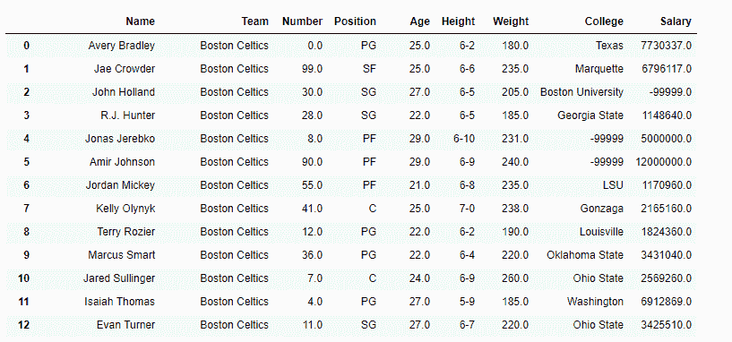

# Python | Pandas data frame . replace()

> 原文:[https://www . geesforgeks . org/python-pandas-data frame-replace/](https://www.geeksforgeeks.org/python-pandas-dataframe-replace/)

Python 是进行数据分析的优秀语言，主要是因为以数据为中心的 python 包的奇妙生态系统。 ***【熊猫】*** 就是其中一个包，让导入和分析数据变得容易多了。

熊猫`**dataframe.replace()**`功能用于替换一个[字符串](https://www.geeksforgeeks.org/python-strings/)、regex、[列表](https://www.geeksforgeeks.org/python-list/)、[字典](https://www.geeksforgeeks.org/python-dictionary/)、系列、编号等。从数据帧中。这是一个非常丰富的功能，因为它有许多变化。
这个函数最强大的地方是可以和 [Python regex](https://www.geeksforgeeks.org/regular-expression-python-examples-set-1/) (正则表达式)配合使用。

> **语法:**data frame . replace(to _ replace = None，value=None，inplace=False，limit=None，regex=False，方法='pad '，axis=None)
> 
> **参数:**
> **to _ replace:**【str，regex，list，dict，Series，numeric，或 None】我们试图在 dataframe 中替换的模式。
> **值:**用于填充孔的值(例如 0)，或者指定每列使用哪个值的值字典(不在字典中的列将不会被填充)。正则表达式、字符串以及这类对象的列表或字典也是允许的。
> **就位:**如果为真，就位。注意:这将修改该对象上的任何其他视图(例如，数据框中的列)。如果为真，则返回调用方。
> **限制:**向前或向后填充的最大尺寸间隙
> **正则表达式:**是否将 to_replace 和/或 value 解释为正则表达式。如果为真，则 to_replace 必须是字符串。否则，to_replace 必须为 None，因为此参数将被解释为正则表达式或正则表达式的列表、字典或数组。
> **方法:**方法使用时为替换，when _ replace 为列表。
> 
> **返回:**填充:NDFrame

有关代码中使用的 CSV 文件的链接，请单击此处的

**示例#1:** 在 nba.csv 文件中将球队“波士顿凯尔特人”替换为“欧米茄勇士”

```py
# importing pandas as pd
import pandas as pd

# Making data frame from the csv file
df = pd.read_csv("nba.csv")

# Printing the first 10 rows of the data frame for visualization
df[:10]
```

**输出:**



我们将在“df”数据框中用“欧米茄勇士”替换“波士顿凯尔特人”队

```py
# this will replace "Boston Celtics" with "Omega Warrior"
df.replace(to_replace ="Boston Celtics",
                 value ="Omega Warrior")
```

**输出:**



**示例#2:** 一次替换多个值。使用 python 列表作为参数

我们将在“df”数据框中用“欧米茄战士”替换“波士顿凯尔特人”和“德克萨斯”队。

```py
# importing pandas as pd
import pandas as pd

# Making data frame from the csv file
df = pd.read_csv("nba.csv")

# this will replace "Boston Celtics" and "Texas" with "Omega Warrior"
df.replace(to_replace =["Boston Celtics", "Texas"], 
                            value ="Omega Warrior")
```

**输出:**

注意第一行的 College 列中，“Texas”已替换为“Omega Warriors”

**示例#3:** 将数据框中的 Nan 值替换为-99999 值。

```py
# importing pandas as pd
import pandas as pd

# Making data frame from the csv file
df = pd.read_csv("nba.csv")

# will replace  Nan value in dataframe with value -99999 
df.replace(to_replace = np.nan, value =-99999)
```

**输出:**

注意数据框中的所有`Nan` 值已被-99999 替换。尽管出于实际目的，我们应该小心我们正在替换的`nan` 值。