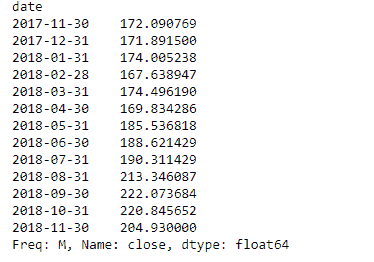
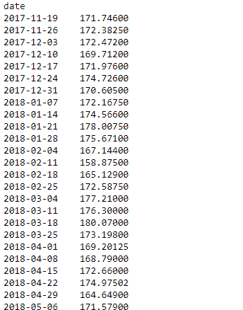
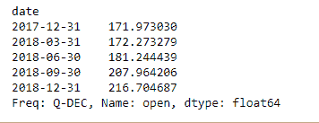

# Python | Pandas data frame . resample()

> 原文:[https://www . geesforgeks . org/python-pandas-data frame-resample/](https://www.geeksforgeeks.org/python-pandas-dataframe-resample/)

Python 是进行数据分析的优秀语言，主要是因为以数据为中心的 python 包的奇妙生态系统。 ***【熊猫】*** 就是其中一个包，让导入和分析数据变得容易多了。

熊猫 `**dataframe.resample()**`功能主要用于时间序列数据。
时间序列是按时间顺序索引(或列出或绘制)的一系列数据点。最常见的是，时间序列是在连续等间隔的时间点上取得的序列。这是一种方便的时间序列频率转换和重采样方法。对象必须具有类似日期时间的索引(日期时间索引、周期索引或时间增量索引)，或者将类似日期时间的值传递给 on 或 level 关键字。

> **语法:** DataFrame.resample(规则，how=None，axis=0，fill_method=None，closed=None，label=None，约定='start '，kind=None，loffset=None，limit=None，base=0，on=None，level=None)
> 
> **参数:**
> **规则:**表示目标转换的偏移字符串或对象
> **轴:** int，可选，默认 0
> **closed :** {【右】、【左】}
> **标签:** {【右】、【左】}
> **约定:**仅用于 PeriodIndex，控制是使用规则
> **的开始还是结束 loffset :** 调整例如，对于“5 分钟”频率，基数可以从 0 到 4。默认为 0。
> **on :** 对于数据帧，使用列代替索引进行重采样。列必须类似于日期时间。
> **级别:**对于多索引，用于重采样的级别(名称或编号)。级别必须类似于日期时间。

重采样根据实际数据生成唯一的采样分布。我们可以应用各种频率对时间序列数据进行重新采样。这是分析领域非常重要的技术。
最常用的时间序列频率为–
**W:**周频率
T5】M:月末频率
**SM :** 半月末频率(15 日和月末)
**Q :** 季度末频率

还有许多其他类型的时间序列频率可用。让我们看看如何将这些时间序列频率应用于数据并对其进行重新采样。

有关代码中使用的 CSV 文件的链接，请单击此处的

这是苹果公司从(13-11-17)到(13-11-18)一年的股价数据

**示例#1:** 按月频率对数据进行重采样

```py
# importing pandas as pd
import pandas as pd

# By default the "date" column was in string format,
# we need to convert it into date-time format

# parse_dates =["date"], converts the "date" 
# column to date-time format. We know that 
# resampling works with time-series data only
# so convert "date" column to index

# index_col ="date", makes "date" column, the index of the data frame
df = pd.read_csv("apple.csv", parse_dates =["date"], index_col ="date")

# Printing the first 10 rows of dataframe
df[:10]
```


```py
# Resampling the time series data based on months
# we apply it on stock close price
# 'M' indicates month
monthly_resampled_data = df.close.resample('M').mean()

# the above command will find the mean closing price
# of each month for a duration of 12 months.
monthly_resampled_data
```

**输出:**


**示例#2:** 按周频率对数据进行重采样

```py
# importing pandas as pd
import pandas as pd

# We know that resampling works with time-series data
# only so convert "date" column to index
# index_col ="date", makes "date" column.

df = pd.read_csv("apple.csv", parse_dates =["date"], index_col ="date")

# Resampling the time series data based on weekly frequency
# we apply it on stock open price 'W' indicates week
weekly_resampled_data = df.open.resample('W').mean()

# find the mean opening price of each week 
# for each week over a period of 1 year.
weekly_resampled_data
```

**输出:**


**示例#3:** 按季度频率对数据进行重采样

```py
# importing pandas as pd
import pandas as pd

# We know that resampling works with time-series
#  data only so convert our "date" column to index
# index_col ="date", makes "date" column
df = pd.read_csv("apple.csv", parse_dates =["date"], index_col ="date")

# Resampling the time series data
#  based on Quarterly frequency
# 'Q' indicates quarter

Quarterly_resampled_data = df.open.resample('Q').mean()

# mean opening price of each quarter
# over a period of 1 year.
Quarterly_resampled_data
```

**输出:**
