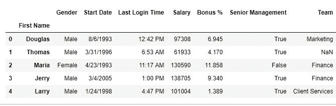
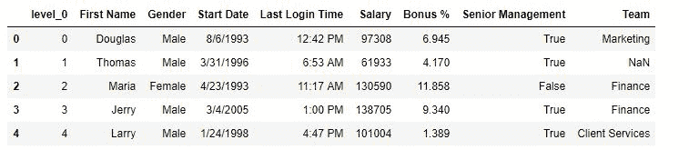
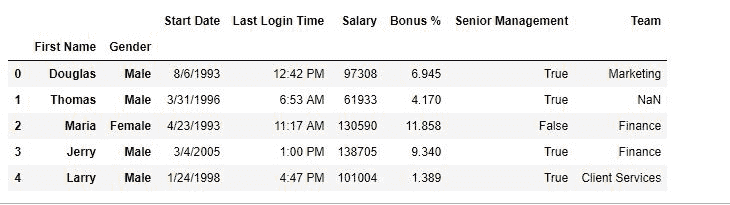
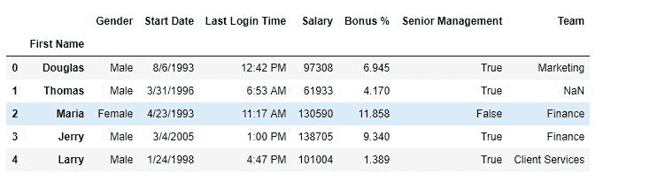

# Python | Pandas data frame . reset _ index()

> 原文:[https://www . geesforgeks . org/python-pandas-data frame-reset _ index/](https://www.geeksforgeeks.org/python-pandas-dataframe-reset_index/)

Python 是进行数据分析的优秀语言，主要是因为以数据为中心的 python 包的奇妙生态系统。 ***【熊猫】*** 就是其中一个包，让导入和分析数据变得容易多了。

熊猫 **`reset_index()`** 是一种重置数据框索引的方法。reset_index()方法将从 0 到数据长度的整数列表设置为索引。

> **语法:**
> data frame . reset _ index(level = None，drop=False，inplace=False，col_level=0，col_fill=)
> 
> **参数:**
> **级别:** int，字符串或列表，用于从索引中选择和移除传递的列。
> **删除:**布尔值，如果为假，则将替换的索引列添加到数据中。
> **替换:**布尔值，如果为真，则对原始数据框本身进行更改。
> **col_level:** 选择在哪个列级别插入标签。
> **col_fill:** Object，确定其他级别如何命名。
> 
> **返回类型:**数据帧

要下载使用的 CSV 文件，点击这里[。](https://media.geeksforgeeks.org/wp-content/uploads/employees.csv)

**示例#1:** 重置索引
在此示例中，要重置索引，首先将名字列设置为索引列，然后使用重置索引生成新索引。

```
# importing pandas package
import pandas as pd

# making data frame from csv file
data = pd.read_csv("employees.csv")

# setting first name as index column
data.set_index(["First Name"], inplace = True,
                    append = True, drop = True)

# resetting index
data.reset_index(inplace = True)

# display
data.head()
```

**输出:**
如输出图像所示，已经生成了名为 level_0 的新索引标签。

**复位前–**


**复位后–**


**示例#2:** 对多级索引的操作
在本示例中，索引列中添加了 2 列(名字和性别)，稍后使用 reset_index()方法删除了一级。

```
# importing pandas package
import pandas as pd

# making data frame from csv file
data = pd.read_csv("employees.csv")

# setting first name as index column
data.set_index(["First Name", "Gender"], inplace = True,
                             append = True, drop = True)

# resetting index
data.reset_index(level = 2, inplace = True, col_level = 1)

# display
data.head()
```

**输出:**
如输出图像所示，索引列中的性别列被替换，因为它的级别是 2。

**复位前–**


**复位后–**
