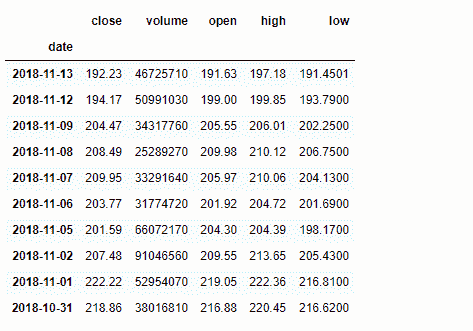
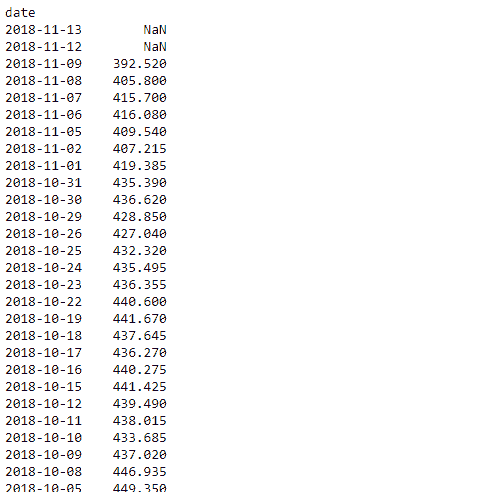
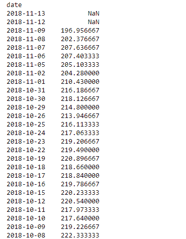

# Python | Pandas data frame . rolling()

> 原文:[https://www . geesforgeks . org/python-pandas-data frame-rolling/](https://www.geeksforgeeks.org/python-pandas-dataframe-rolling/)

Python 是进行数据分析的优秀语言，主要是因为以数据为中心的 python 包的奇妙生态系统。 ***【熊猫】*** 就是其中一个包，让导入和分析数据变得容易多了。

熊猫 `**dataframe.rolling()**`功能提供了滚动窗口计算的功能。滚动窗口计算的概念主要用于信号处理和时间序列数据。简单地说，我们一次取一个大小为 k 的窗口，并对其执行一些所需的数学运算。大小为 k 的窗口意味着一次有 k 个连续的值。在一个非常简单的情况下，所有的“k”值都是等权重的。

> **语法:**数据帧.滚动(窗口，min _ periods =无，freq =无，中心=假，win _ type =无，on =无，轴=0，关闭=无)
> 
> **参数:**
> **窗口:**移动窗口的大小。这是用于计算统计数据的观察数。每个窗口的大小都是固定的。如果这是一个偏移量，那么这将是每个窗口的时间周期。每个窗口都是一个变量，其大小基于时间段中包含的观察值。这仅对 datetimelike 索引有效。
> **min_periods :** 窗口中需要有值的最小观察次数(否则结果为 NA)。对于由偏移量指定的窗口，这将默认为 1。
> **freq :** 在计算统计数据之前，使数据符合的频率。指定为频率字符串或日期偏移量对象。
> **居中:**将标签设置在窗口中央。
> **win_type :** 提供窗口类型。请参见下面的注释。
> **on :** 对于数据帧，计算滚动窗口的列，而不是索引
> **closed :** 使间隔在“右”、“左”、“两者”或“两者都不是”端点上关闭。对于基于偏移的窗口，它默认为“右”。对于固定窗口，默认为“两者都有”。固定窗口未实现的剩余情况。
> **轴:** int 或 string，默认为 0

**注意:**freq 关键字用于通过对数据进行重采样来确认时间序列数据达到指定频率。这是通过`resample()`的默认参数完成的(即使用平均值)。
如果 win_type=none，则窗口中的所有值被平均加权。还有各种其他类型滚动窗类型。要了解其他滚动窗类型的更多信息，请参考[本](https://docs.scipy.org/doc/scipy/reference/signal.html#window-functions) scipy 文档。

有关代码中使用的 CSV 文件的链接，请单击此处的。这是苹果公司从(13-11-17)到(13-11-18)一年的股价数据

**示例#1:** 在股票收盘价列上有大小为 3 的窗口的滚动总和

```py
# importing pandas as pd
import pandas as pd

# By default the "date" column was in string format,
#  we need to convert it into date-time format
# parse_dates =["date"], converts the "date" column to date-time format

# Resampling works with time-series data only
# so convert "date" column to index
# index_col ="date", makes "date" column
df = pd.read_csv("apple.csv", parse_dates =["date"], index_col ="date")

# Printing the first 10 rows of dataframe
df[:10]
```



```py
# 3 indicates the window size
# we have selected 'triang' type window
# which returns triangular type window

# sum() function find the sum over
# all the windows in our data frame
df.close.rolling(3, win_type ='triang').sum()
```

**输出:**


**示例#2:** 滚动窗口意味着超过 3 的窗口大小。我们使用默认的窗口类型，即无。所以所有的值将被平均加权。

```py
# importing pandas as pd
import pandas as pd

df = pd.read_csv("apple.csv", parse_dates =["date"], index_col ="date")

# close is the column on which
# we are performing the operation
# mean() function finds the mean over each window
df.close.rolling(3).mean()
```

**输出:**
