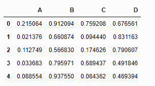
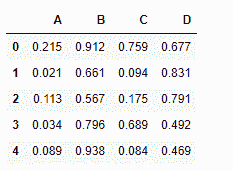
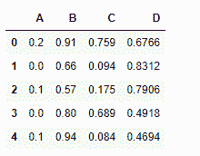

# Python | Pandas data frame . round()

> 原文:[https://www . geesforgeks . org/python-pandas-data frame-round/](https://www.geeksforgeeks.org/python-pandas-dataframe-round/)

Python 是进行数据分析的优秀语言，主要是因为以数据为中心的 python 包的奇妙生态系统。 ***【熊猫】*** 就是其中一个包，让导入和分析数据变得容易多了。

熊猫 `**dataframe.round()**`函数用于将数据帧舍入到可变的小数位数。该函数提供了根据不同位置舍入不同列的灵活性。

> **语法:** DataFrame.round(小数=0，*args，* * * kwargs)
> **参数:**
> **小数:**每列要舍入到的小数位数。如果给定一个 int，则将每列四舍五入到相同的位数。否则，dict 和 Series 舍入到可变的位数。如果小数是类似字典的，列名应该在键中，如果小数是数列，列名应该在索引中。任何未包含在小数中的列将保持原样。不是输入列的小数元素将被忽略。
> 
> **返回:**数据框对象

**示例#1:** 使用`round()`函数将数据框中的所有列四舍五入到小数点后 3 位

**注意:**我们需要用十进制值填充数据框。让我们使用 numpy 随机函数来完成任务。

```py
# importing pandas as pd
import pandas as pd

# importing numpy as np
import numpy as np

# setting the seed to re-create the dataframe
np.random.seed(25)

# Creating a 5 * 4 dataframe 
df = pd.DataFrame(np.random.random([5, 4]), columns =["A", "B", "C", "D"])

# Print the dataframe
df
```



让我们使用`dataframe.round()`函数将数据框中的所有小数值四舍五入到小数点后 3 位。

```py
df.round(3)
```

**输出:**


**示例 2:** 使用`round()`功能将数据框中的所有列舍入到不同的位置。

```py
# importing pandas as pd
import pandas as pd

# importing numpy as np
import numpy as np

# setting the seed to re-create the dataframe
np.random.seed(25)

# Creating a 5 * 4 dataframe 
df = pd.DataFrame(np.random.random([5, 4]), columns =["A", "B", "C", "D"])

# Print the dataframe
df
```


让我们将每一列舍入到不同的位置

```py
# round off the columns in this manner
# "A" to 1 decimal place
# "B" to 2 decimal place
# "C" to 3 decimal place
# "D" to 4 decimal place

df.round({"A":1, "B":2, "C":3, "D":4})
```

**输出:**

