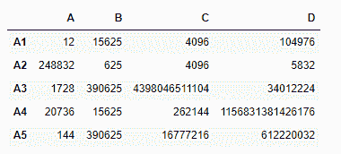
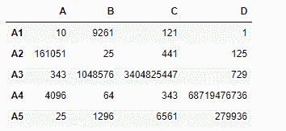

# python | pandas data frame . r w()

> 哎哎哎:# t0]https://www . geeksforgeeks . org/python 熊猫 data frame-r ww/

Python 是进行数据分析的优秀语言，主要是因为以数据为中心的 python 包的奇妙生态系统。 ***【熊猫】*** 就是其中一个包，让导入和分析数据变得容易多了。

熊猫 `**dataframe.rpow()**`函数用于求数据帧和其他元素的指数幂(二进制运算符 rfloordiv)。该功能本质上与执行`other ** dataframe`相同，但支持替换其中一个输入中缺失的数据。

> **语法:** DataFrame.rpow(other，axis='columns '，level=None，fill_value=None)
> **参数:**
> **other :** Series，DataFrame，或常量
> **axis :** 对于 Series 输入，axis 要匹配
> **级别上的 Series 索引:**跨级别广播，匹配传递的 MultiIndex leve 上的索引值
> **fill_value :** Fill 如果两个相应数据框位置的数据都丢失，结果也将丢失。
> 
> **返回:**结果:数据帧

**示例#1:** 使用`rpow()`函数将序列中的每个元素提升到列轴上数据框中的相应值。

```py
# importing pandas as pd
import pandas as pd

# Creating the dataframe 
df = pd.DataFrame({"A":[1, 5, 3, 4, 2],
                   "B":[3, 2, 4, 3, 4], 
                   "C":[2, 2, 7, 3, 4], 
                   "D":[4, 3, 6, 12, 7]},
                    index =["A1", "A2", "A3", "A4", "A5"])

# Print the dataframe
df
```


让我们创建这个系列

```py
# importing pandas as pd
import pandas as pd

# Create the series
sr = pd.Series([12, 25, 64, 18], index =["A", "B", "C", "D"])

# Print the series
sr
```


让我们使用`dataframe.rpow()`函数将一系列中的每个元素提升到数据框中相应元素的幂。

```py
# equivalent to sr ** df
df.rpow(sr, axis = 1)
```

**输出:**


**示例 2:** 使用`rpow()`函数将数据帧中的每个元素提升到其他数据帧中相应元素的幂

```py
# importing pandas as pd
import pandas as pd

# Creating the first dataframe 
df1 = pd.DataFrame({"A":[1, 5, 3, 4, 2],
                    "B":[3, 2, 4, 3, 4],
                    "C":[2, 2, 7, 3, 4],
                    "D":[4, 3, 6, 12, 7]},
                     index =["A1", "A2", "A3", "A4", "A5"])

# Creating the second dataframe
df2 = pd.DataFrame({"A":[10, 11, 7, 8, 5],
                    "B":[21, 5, 32, 4, 6],
                    "C":[11, 21, 23, 7, 9],
                    "D":[1, 5, 3, 8, 6]}, 
                     index =["A1", "A2", "A3", "A4", "A5"])

# Print the first dataframe
print(df1)

# Print the second dataframe
print(df2)
```


让我们执行`df2 ** df1`

```py
# raise df2 to the power of df1
df1.rpow(df2)
```

**输出:**

