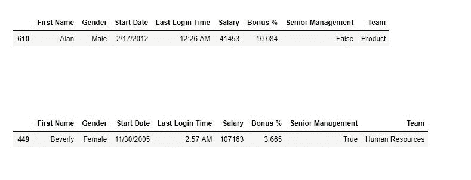
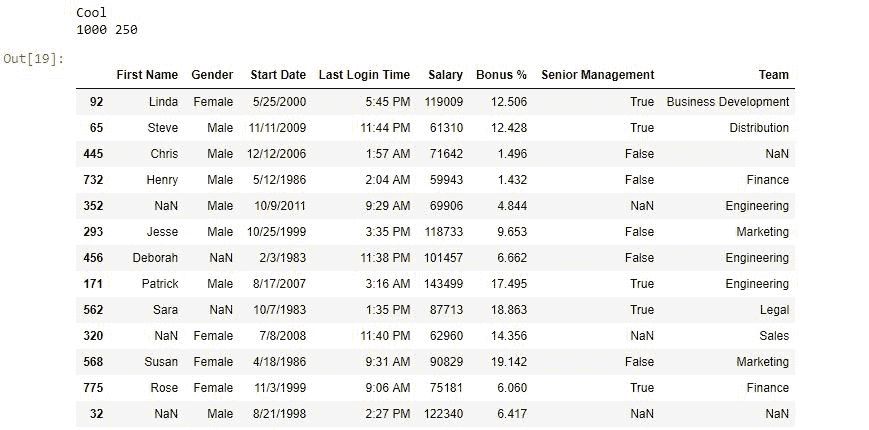

# Python | Pandas data frame . sample()

> 原文:[https://www . geesforgeks . org/python-pandas-data frame-sample/](https://www.geeksforgeeks.org/python-pandas-dataframe-sample/)

Python 是进行数据分析的优秀语言，主要是因为以数据为中心的 python 包的奇妙生态系统。Pandas 就是其中之一，它让数据的导入和分析变得更加容易。

Pandas `**sample()**`用于从函数调用方数据帧中生成一个样本随机行或列。

> **语法:**
> 
> 数据帧样本(n =无，frac =无，替换=假，权重=无，随机状态=无，轴=无)
> 
> **参数:**
> 
> **n:** 整数值，要生成的随机行数。
> **frac:** 浮点值，返回(浮点值*数据帧值的长度)。frac 不能与 n.
> **一起使用。替换:**布尔值，如果为真，则返回替换样本。
> **random_state:** int 值或 numpy.random.RandomState，可选。如果设置为特定整数，将在每次迭代中返回与示例相同的行。
> **轴:** 0 或“行”代表行，1 或“列”代表列。

**返回类型:**与调用者类型相同的新对象。

要下载使用的 CSV 文件，点击这里[。](https://media.geeksforgeeks.org/wp-content/uploads/employees.csv)

**示例#1:** 数据帧中的随机行

在此示例中，两个随机行由。sample()方法，稍后进行比较。

```
# importing pandas package
import pandas as pd

# making data frame from csv file 
data = pd.read_csv("employees.csv")

# generating one row 
row1 = data.sample(n = 1)

# display
row1

# generating another row
row2 = data.sample(n = 1)

# display
row2
```

**输出:**
如输出图像所示，生成的两个随机样本行互不相同。


**示例#2:** 生成数据帧的 25%样本
在本示例中，从数据帧中生成 25%的随机样本数据。

```
# importing pandas package
import pandas as pd

# making data frame from csv file 
data = pd.read_csv("employees.csv")

# generating one row 
rows = data.sample(frac =.25)

# checking if sample is 0.25 times data or not

if (0.25*(len(data))== len(rows)):
    print( "Cool")
    print(len(data), len(rows))

# display
rows
```

**输出:**
如输出图像所示，生成的样本长度为数据帧的 25%。样本也是随机生成的。

