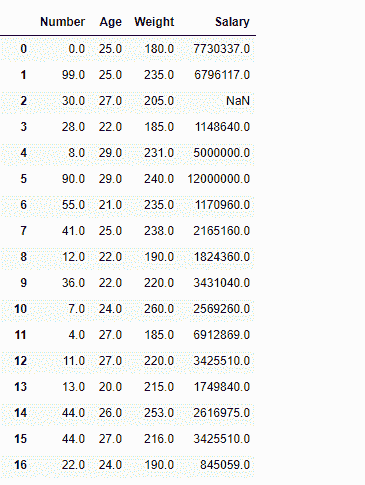
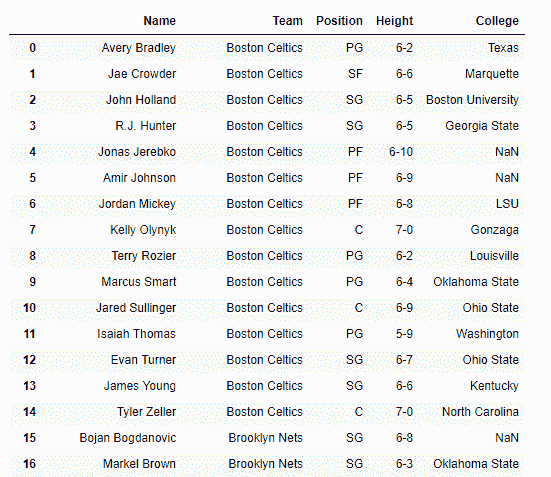

# Python | Pandas data frame . select _ dt types()

> 原文:[https://www . geesforgeks . org/python-pandas-data frame-select _ dt types/](https://www.geeksforgeeks.org/python-pandas-dataframe-select_dtypes/)

Python 是进行数据分析的优秀语言，主要是因为以数据为中心的 python 包的奇妙生态系统。 ***【熊猫】*** 就是其中一个包，让导入和分析数据变得容易多了。

熊猫 `**dataframe.select_dtypes()**`函数根据列数据类型返回数据框列的子集。此函数的参数可以设置为包括具有某些特定数据类型的所有列，也可以设置为排除具有某些特定数据类型的所有列。

> **语法:**数据框。选择 _ 数据类型(包括=无，排除=无)
> 
> **参数:**
> **包含、排除:**要包含/排除的数据类型或字符串的选择。必须至少提供其中一个参数。
> 
> **返回:**包含数据类型和排除数据类型的帧子集。

有关代码中使用的 CSV 文件的链接，请单击此处的

**示例#1:** 使用`select_dtypes()`功能选择所有具有浮动数据类型的列。

```py
# importing pandas as pd
import pandas as pd

# Creating the dataframe 
df = pd.read_csv("nba.csv")

# Print the dataframe
df
```


让我们使用`dataframe.select_dtypes()`函数选择数据框中所有具有浮点数据类型的列。

```py
# select all columns having float datatype
df.select_dtypes(include ='float64')
```

**输出:**


**示例 2:** 使用`select_dtypes()`功能选择数据框中的所有列，浮动数据类型的列除外。

```py
# importing pandas as pd
import pandas as pd

# Creating the dataframe 
df = pd.read_csv("nba.csv")

# select all columns except float based
df.select_dtypes(exclude ='float64')
```

**输出:**
