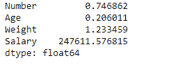
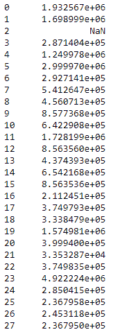

# python | pandas data frame . SEM()

> 哎哎哎:# t0]https://www . geeksforgeeks . org/python 熊猫 dataframe-sem/

Python 是进行数据分析的优秀语言，主要是因为以数据为中心的 python 包的奇妙生态系统。 ***【熊猫】*** 就是其中一个包，让导入和分析数据变得容易多了。

熊猫 `**dataframe.sem()**`函数返回要求轴上平均值的无偏标准误差。统计量的标准误差(SE)(通常是参数的估计值)是其抽样分布的标准偏差[1]或该标准偏差的估计值。如果参数或统计量是平均值，则称之为平均值的标准误差。

> **语法:** DataFrame.sem(轴=无，skipna =无，级别=无，ddof=1，numeric _ only =无，**kwargs)
> 
> **参数:**
> **轴:**{索引(0)，列(1)}
> **skipna :** 排除 NA/null 值。如果整行/整列是 NA，结果将是 NA
> **级别:**如果轴是多索引(分层)，沿特定级别计数，折叠成系列
> **ddof:**δ自由度。计算中使用的除数是 N–ddof，其中 N 代表元素的数量。
> **numeric_only :** 只包括 float、int、boolean 列。如果没有，将尝试使用所有内容，然后只使用数字数据。不适用于系列
> 
> **返回:**扫描电镜:系列或数据框(如果指定了级别)

有关代码中使用的 CSV 文件的链接，请单击此处的

**示例#1:** 使用`sem()`函数找到给定数据帧在索引轴上的平均值的标准误差。

```py
# importing pandas as pd
import pandas as pd

# Creating the dataframe 
df = pd.read_csv("nba.csv")

# Print the dataframe
df
```


让我们使用`dataframe.sem()`函数来寻找指数轴上平均值的标准误差。

```py
# find standard error of the mean of all the columns
df.sem(axis = 0)
```

**输出:**

注意，所有非数字列和值都不会自动包含在数据框的计算中。我们不需要专门输入数值列来计算平均值的标准误差。

**例 2:** 用`sem()`函数求柱轴上平均值的标准误差。在计算数据帧时也不要跳过`NaN`值。

```py
# importing pandas as pd
import pandas as pd

# Creating the dataframe 
df = pd.read_csv("nba.csv")

# Calculate the standard error of 
# the mean of all the rows in dataframe
df.sem(axis = 1, skipna = False)
```

**输出:**

当我们包括`NaN`值时，它将导致该特定行或列为`NaN`