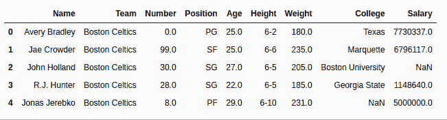
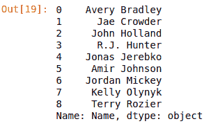

# Python | Pandas data frame/series . head()方法

> 原文:[https://www . geesforgeks . org/python-pandas-data frame-series-head-method/](https://www.geeksforgeeks.org/python-pandas-dataframe-series-head-method/)

Python 是进行数据分析的优秀语言，主要是因为以数据为中心的 Python 包的奇妙生态系统。 ***【熊猫】*** 就是其中一个包，让导入和分析数据变得容易多了。

Pandas **`head()`** 方法用于返回数据框或系列的前 n 行(默认为 5 行)。

> **语法:** Dataframe.head(n=5)
> 
> **参数:**
> **n:** 整数值，要返回的行数
> 
> **返回类型:**前 n 行的数据框

要下载下例使用的数据集，点击这里的[。](https://media.geeksforgeeks.org/wp-content/uploads/nba.csv)
在下面的例子中，使用的数据框包含了一些 NBA 球员的数据。任何操作前的数据框图像附在下面。


**示例#1:**

在本例中，数据框的前 5 行被返回并存储在一个新的变量中。没有参数传递给。head()方法，因为默认情况下它是 5。

```
# importing pandas module
import pandas as pd

# making data frame
data = pd.read_csv("https://media.geeksforgeeks.org/wp-content/uploads/nba.csv")

# calling head() method 
# storing in new variable
data_top = data.head()

# display
data_top
```

**输出:**
如输出图所示，可以看到返回行的索引范围是 0 到 4。因此，返回了前 5 行。


**示例#2:** 调用带 n 个参数的系列()

在本例中。head()方法在自定义输入 n 个参数的序列上调用，以返回序列的前 9 行。

```
# importing pandas module
import pandas as pd

# making data frame
data = pd.read_csv("https://media.geeksforgeeks.org/wp-content/uploads/nba.csv")

# number of rows to return
n = 9

# creating series
series = data["Name"]

# returning top n rows
top = series.head(n = n)

# display
top
```

**输出:**
如输出图像所示，返回了从 0 到第 8 个索引位置的前 9 行。
