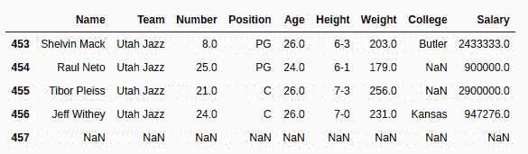
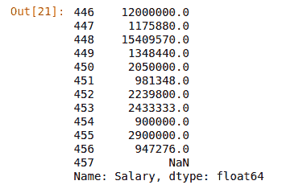

# Python | Pandas data frame/series . tail()方法

> 原文:[https://www . geesforgeks . org/python-pandas-data frame-series-tail-method/](https://www.geeksforgeeks.org/python-pandas-dataframe-series-tail-method/)

Python 是进行数据分析的优秀语言，主要是因为以数据为中心的 Python 包的奇妙生态系统。 ***【熊猫】*** 就是其中一个包，让导入和分析数据变得容易多了。

熊猫 **`tail()`** 方法用于返回数据帧或序列的底部 n(默认为 5)行。

> **语法:** Dataframe.tail(n=5)
> 
> **参数:**
> **n:** 整数值，要返回的行数
> 
> **返回类型:**底部有 n 行的数据框

要下载下例使用的数据集，点击这里的[。](https://media.geeksforgeeks.org/wp-content/uploads/nba.csv)
在下面的例子中，使用的数据框包含了一些 NBA 球员的数据。任何操作前的数据框图像附在下面。


**示例#1:**
在此示例中，返回数据框的最后 5 行，并将其存储在一个新变量中。没有参数传递给 `.tail()`方法，因为默认情况下是 5。

```py
# importing pandas module
import pandas as pd

# making data frame
data = pd.read_csv("https://media.geeksforgeeks.org/wp-content/uploads/nba.csv")

# calling tail() method 
# storing in new variable
data_bottom = data.tail()

# display
data_bottom
```

**输出:**
如输出图所示，可以看到返回行的索引在 453 到 457 之间。因此，返回了最后 5 行。


**示例#2:** 调用带 n 个参数的系列()

在本例中。在自定义输入 n 个参数的序列上调用 tail()方法，返回序列的最后 12 行。

```py
# importing pandas module
import pandas as pd

# making data frame
data = pd.read_csv("https://media.geeksforgeeks.org/wp-content/uploads/nba.csv")

# number of rows to return
n = 12

# creating series
series = data["Salary"]

# returning top n rows
bottom = series.tail(n = n)

# display
bottom
```

**输出:**
如输出图像所示，返回了工资列第 446 到第 457 个索引位置的前 12 行。
