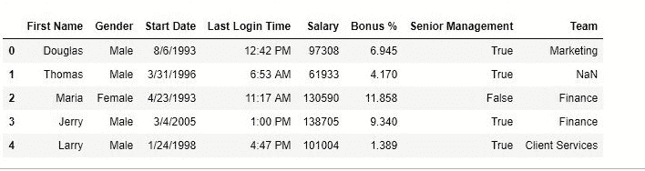
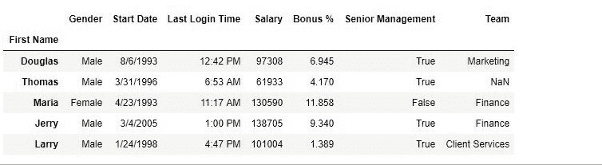
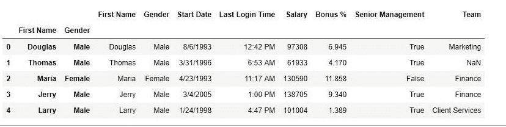
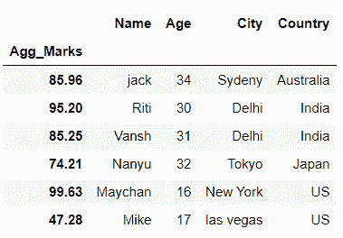
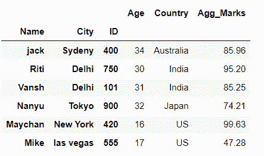

# Python | Pandas data frame . set _ index()

> 原文:[https://www . geesforgeks . org/python-pandas-data frame-set _ index/](https://www.geeksforgeeks.org/python-pandas-dataframe-set_index/)

Python 是进行数据分析的优秀语言，主要是因为以数据为中心的 python 包的奇妙生态系统。 ***【熊猫】*** 就是其中一个包，让导入和分析数据变得容易多了。
熊猫 **set_index()** 是一种将列表、序列或数据框设置为数据框索引的方法。制作数据框时也可以设置索引列。但是有时一个数据帧是由两个或多个数据帧组成的，因此以后的索引可以使用这种方法来更改。
**语法:**

> DataFrame.set_index(键，删除=真，追加=假，插入=假，验证 _ 完整性=假)

**参数:**

> **键:**列名或列名列表。
> **删除:**布尔值，如果为真，则删除用于索引的列。
> **追加:**如果为真，则将该列追加到现有索引列。
> **在位:**如果为真，则在数据框中进行更改。
> **verify_integrity:** 如果为真，则检查新索引列是否有重复。

要下载使用的 CSV 文件，点击这里[。](https://media.geeksforgeeks.org/wp-content/uploads/employees.csv)
**代码#1:** 更改索引列
在本例中，名字列已成为数据框的索引列。

## 蟒蛇 3

```py
# importing pandas package
import pandas as pd

# making data frame from csv file
data = pd.read_csv("employees.csv")

# setting first name as index column
data.set_index("First Name", inplace = True)

# display
data.head()
```

**输出:**
如输出图像所示，早先索引列是一系列数字，但后来它被替换为名字。
**运行前–**



**运行后–**



**代码#2:** 多索引列
在本例中，将两列作为索引列。Drop 参数用于删除列，append 参数用于将传递的列追加到已经存在的索引列。

## 蟒蛇 3

```py
# importing pandas package
import pandas as pd

# making data frame from csv file
data = pd.read_csv("employees.csv")

# setting first name as index column
data.set_index(["First Name", "Gender"], inplace = True,
                            append = True, drop = False)

# display
data.head()
```

**输出:**
如输出图像所示，数据有 3 个索引列。



**代码#3:** 在熊猫数据框
中设置单个**浮动列**作为索引

## 蟒蛇 3

```py
# importing pandas library
import pandas as pd

# creating and initializing a nested list
students = [['jack', 34, 'Sydeny', 'Australia',85.96],
            ['Riti', 30, 'Delhi', 'India',95.20],
            ['Vansh', 31, 'Delhi', 'India',85.25],
            ['Nanyu', 32, 'Tokyo', 'Japan',74.21],
            ['Maychan', 16, 'New York', 'US',99.63],
            ['Mike', 17, 'las vegas', 'US',47.28]]

# Create a DataFrame object
df = pd.DataFrame(students,
                      columns=['Name', 'Age', 'City', 'Country','Agg_Marks'],
                           index=['a', 'b', 'c', 'd', 'e', 'f'])

# here we set Float column 'Agg_Marks' as index of data frame
# using dataframe.set_index() function
df = df.set_index('Agg_Marks')

# Displaying the Data frame
df
```

**输出:**



在上面的例子中，我们将列“ **Agg_Marks** ”设置为数据帧的索引。

**代码#4:** 在熊猫数据框中将**三列**设置为**多索引**

## 蟒蛇 3

```py
# importing pandas library
import pandas as pd

# creating and initializing a nested list
students = [['jack', 34, 'Sydeny', 'Australia',85.96,400],
            ['Riti', 30, 'Delhi', 'India',95.20,750],
            ['Vansh', 31, 'Delhi', 'India',85.25,101],
            ['Nanyu', 32, 'Tokyo', 'Japan',74.21,900],
            ['Maychan', 16, 'New York', 'US',99.63,420],
            ['Mike', 17, 'las vegas', 'US',47.28,555]]

# Create a DataFrame object
df = pd.DataFrame(students,
                      columns=['Name', 'Age', 'City', 'Country','Agg_Marks','ID'],
                           index=['a', 'b', 'c', 'd', 'e', 'f'])

# Here we pass list of 3 columns i.e 'Name', 'City' and 'ID'
# to dataframe.set_index() function
# to set them as multiIndex of dataframe
df = df.set_index(['Name','City','ID'])

# Displaying the Data frame
df
```

**输出:**



在上例中，我们将列“**名称**”、“**城市**”和“ **ID** ”设置为数据框的多索引。