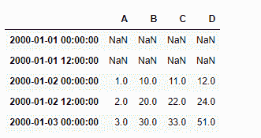
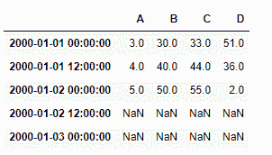
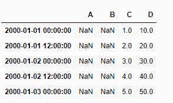
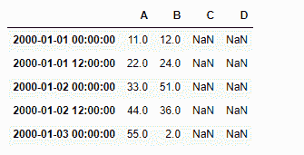

# Python | Pandas data frame . shift()

> 原文:[https://www . geesforgeks . org/python-pandas-data frame-shift/](https://www.geeksforgeeks.org/python-pandas-dataframe-shift/)

Python 是进行数据分析的优秀语言，主要是因为以数据为中心的 python 包的奇妙生态系统。 ***【熊猫】*** 就是其中一个包，让导入和分析数据变得容易多了。
熊猫 **dataframe.shift()** 功能通过可选的时间频率将索引移动所需的周期数。该函数采用一个称为**周期**的标量参数，该参数表示在所需轴上的移动次数。这个函数在处理时间序列数据时非常有用。

> **语法:** DataFrame.shift(periods=1，freq=None，axis=0)
> **参数:**
> **periods :** 要移动的周期数，可以是正的或负的
> **freq :** DateOffset、timedelta 或 time rule string，可选 Increment，可从 tseries 模块或 time rule(例如“EOM”)中使用。参见注释
> **轴:** {0 或“索引”，1 或“列”}
> **返回:**移位:数据框

**示例#1:** 使用 shift()函数将时间序列数据中的索引轴移动 2 个周期

## 蟒蛇 3

```py
# importing pandas as pd
import pandas as pd

# Creating row index values for our data frame
# We have taken time frequency to be of 12 hours interval
# We are generating five index value using "period = 5" parameter

ind = pd.date_range('01 / 01 / 2000', periods = 5, freq ='12H')

# Creating a dataframe with 4 columns
# using "ind" as the index for our dataframe
df = pd.DataFrame({"A":[1, 2, 3, 4, 5],
                   "B":[10, 20, 30, 40, 50],
                   "C":[11, 22, 33, 44, 55],
                   "D":[12, 24, 51, 36, 2]},
                    index = ind)

# Print the dataframe
df
```

**输出:**


让我们使用 dataframe.shift()函数将索引轴正向移动 2 个周期

## 蟒蛇 3

```py
# shift index axis by two periods in positive direction
# axis = 0 is set by default
df.shift(2, axis = 0)
```

**输出:**



让我们将索引轴向负方向移动一些周期

## 蟒蛇 3

```py
# shift index axis by two periods in negative direction
# axis = 0 is set by default
df.shift(-2, axis = 0)
```

**输出:**



**示例#2:** 使用 shift()函数将时间序列数据中的列轴移动 2 个周期

## 蟒蛇 3

```py
# importing pandas as pd
import pandas as pd

# Creating row index values for our data frame
# We have taken time frequency to be of 12 hours interval
# We are generating five index value using "period = 5" parameter

ind = pd.date_range('01 / 01 / 2000', periods = 5, freq ='12H')

# Creating a dataframe with 4 columns
# using "ind" as the index for our dataframe
df = pd.DataFrame({"A":[1, 2, 3, 4, 5],
                   "B":[10, 20, 30, 40, 50],
                   "C":[11, 22, 33, 44, 55],
                   "D":[12, 24, 51, 36, 2]},
                    index = ind)

# Print the dataframe
df
```


让我们使用 dataframe.shift()函数将列轴正向移动 2 个周期

## 蟒蛇 3

```py
# shift column axis by two periods in positive direction
df.shift(2, axis = 1)
```



让我们将列轴向负方向移动一些周期

## 蟒蛇 3

```py
# shift column axis by two periods in negative direction
df.shift(-2, axis = 1)
```

**输出:**

