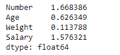
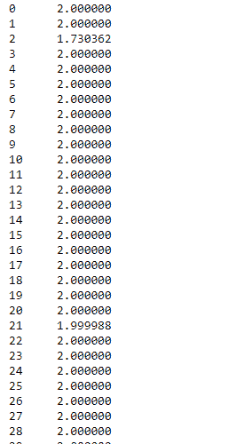

# Python | Pandas data frame . skew()

> 原文:[https://www.geeksforgeeks.org/python-pandas-dataframe-skew/](https://www.geeksforgeeks.org/python-pandas-dataframe-skew/)

Python 是进行数据分析的优秀语言，主要是因为以数据为中心的 python 包的奇妙生态系统。 ***【熊猫】*** 就是其中一个包，让导入和分析数据变得容易多了。

熊猫 `**dataframe.skew()**`函数返回所请求轴上的无偏偏斜，归一化 N-1。偏斜度是实值随机变量关于其均值的概率分布的不对称性的度量。有关偏斜度的更多信息，请参考此[链接](https://en.wikipedia.org/wiki/Skewness)。

> **熊猫:**数据帧.偏斜(轴=无，skipna =无，级别=无，numeric _ only =无，**kwargs)
> 
> **参数:**
> **轴:**{索引(0)，列(1)}
> **skipna :** 计算结果时排除 NA/null 值。
> **级别:**如果轴是多索引(分层的)，沿特定级别计数，折叠成系列
> **仅限数值:**仅包括浮点、int 和布尔列。如果没有，将尝试使用所有内容，然后只使用数字数据。不适用于系列。
> 
> **返回:**偏斜:系列或数据帧(如果指定了级别)

有关代码中使用的 CSV 文件的链接，请单击此处的

**示例#1:** 使用`skew()`函数查找指数轴上数据的偏斜度。

```py
# importing pandas as pd
import pandas as pd

# Creating the dataframe 
df = pd.read_csv("nba.csv")

# Print the dataframe
df
```


让我们使用`dataframe.skew()`函数来寻找偏斜度

```py
# skewness along the index axis
df.skew(axis = 0, skipna = True)
```

**输出:**


**例#2:** 使用`skew()`函数求数据在列轴上的偏斜度。

```py
# importing pandas as pd
import pandas as pd

# Creating the dataframe 
df = pd.read_csv("nba.csv")

# skip the na values
# find skewness in each row
df.skew(axis = 1, skipna = True)
```

**输出:**
