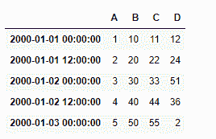
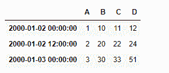
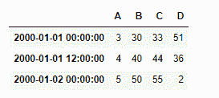
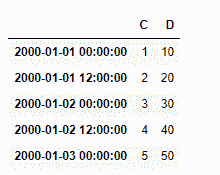
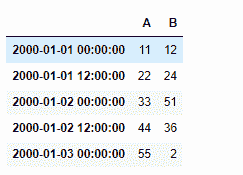

# Python | Pandas data frame . slice _ shift()

> 原文:[https://www . geesforgeks . org/python-pandas-data frame-slice _ shift/](https://www.geeksforgeeks.org/python-pandas-dataframe-slice_shift/)

Python 是进行数据分析的优秀语言，主要是因为以数据为中心的 python 包的奇妙生态系统。 ***【熊猫】*** 就是其中一个包，让导入和分析数据变得容易多了。

熊猫 `**dataframe.slice_shift()**`功能相当于不复制数据的移位。移位的数据将不包括丢失的周期，并且移位的轴将小于原始轴。这个函数只是在给定的轴上沿指定的方向减少指定的周期数。

> **语法:** DataFrame.slice_shift(周期=1，轴=0)
> 
> **参数:**
> **周期:**要移动的周期数，可以是正数也可以是负数
> 
> **返回:**移位:与来电者类型相同

**示例#1:** 使用`slice_shift()`功能将时间序列数据中的指数轴移动 2 个周期

```
# importing pandas as pd
import pandas as pd

# Creating row index values for dataframe
# We have taken time frequency to be of 12 hours interval
# Generating five index value using "period = 5" parameter
ind = pd.date_range('01/01/2000', periods = 5, freq ='12H')

# Creating a dataframe with 4 columns
# using "ind" as the index for our dataframe
df = pd.DataFrame({"A":[1, 2, 3, 4, 5], 
                   "B":[10, 20, 30, 40, 50], 
                   "C":[11, 22, 33, 44, 55],
                   "D":[12, 24, 51, 36, 2]}, index = ind)

# Print the dataframe
df
```



让我们使用`dataframe.slice_shift()`功能将索引轴正向移动 2 个周期

```
# shift index axis by two
# periods in positive direction
# axis = 0 is set by default
df.slice_shift(2, axis = 0)
```

**输出:**

注意索引标签，前两个标签掉了，但是数据正向移动了两个周期。

我们还可以将索引轴向负方向移动一些周期

```
# shift index axis by two 
# periods in negative direction
# axis = 0 is set by default
df.slice_shift(-2, axis = 0)
```

**输出:**

注意在输出中，数据点已经向负方向(即向上)移动了 2 个周期，最后两个索引标签已经被移除。

**示例 2:** 使用`slice_shift()`功能将时间序列数据中的列轴移动 2 个周期

```
# importing pandas as pd
import pandas as pd

# Creating row index values for our data frame
# Taken time frequency to be of 12 hours interval
# Generating five index value using "period = 5" parameter

ind = pd.date_range('01/01/2000', periods = 5, freq ='12H')

# Creating a dataframe with 4 columns
# using "ind" as the index for our dataframe
df = pd.DataFrame({"A":[1, 2, 3, 4, 5],
                   "B":[10, 20, 30, 40, 50],
                   "C":[11, 22, 33, 44, 55],
                   "D":[12, 24, 51, 36, 2]}, index = ind)

# shift column axis by two periods in positive direction
df.slice_shift(2, axis = 1)
```

**输出:**

在输出中，我们可以看到前两列标签被移除，数据点沿列轴正向移动了 2 个周期。

我们还可以将列轴向负方向移动一些周期

```
# shift column axis by two periods in negative direction
df.slice_shift(-2, axis = 0)
```

**输出:**

在输出中，我们可以看到最后两个列标签被移除，数据点沿着列轴在负方向(即向左)移动了 2 个周期。