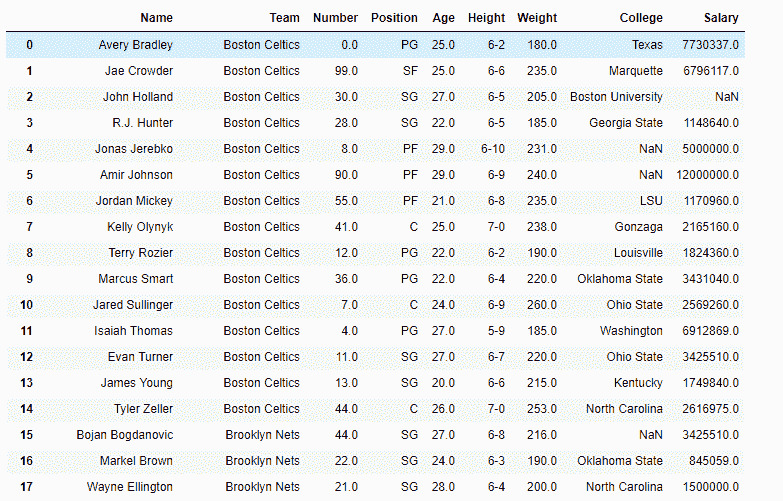
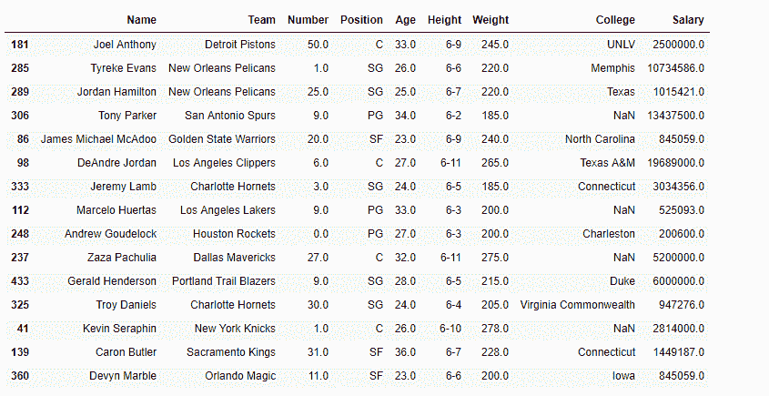
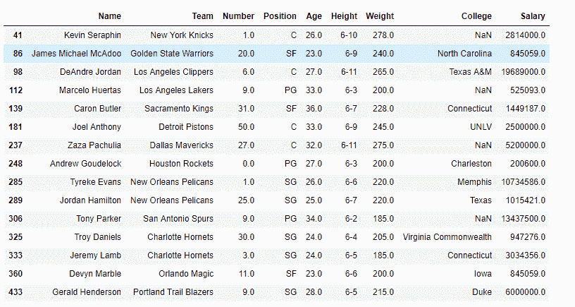
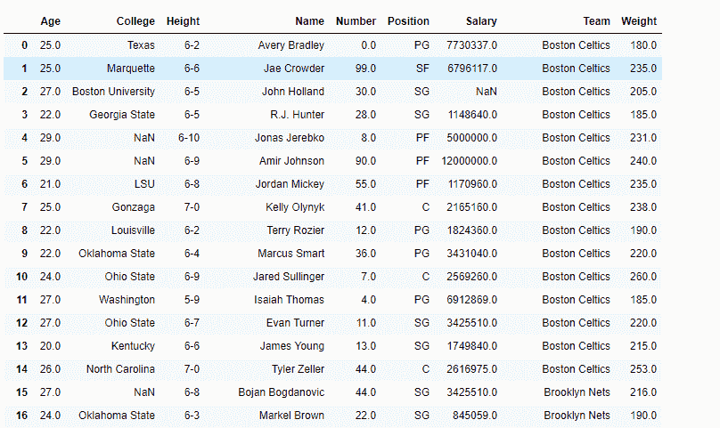

# Python | Pandas data frame . sort _ index()

> 原文:[https://www . geesforgeks . org/python-pandas-data frame-sort _ index/](https://www.geeksforgeeks.org/python-pandas-dataframe-sort_index/)

Python 是进行数据分析的优秀语言，主要是因为以数据为中心的 python 包的奇妙生态系统。 ***【熊猫】*** 就是其中一个包，让导入和分析数据变得容易多了。
熊猫 **dataframe.sort_index()** 函数按照给定轴上的标签对对象进行排序。
基本上，排序算法应用于轴标签，而不是数据框中的实际数据，并基于此重新排列数据。我们可以自由选择我们想要应用的排序算法。有三种可能的排序算法，我们可以使用' quicksort '，' mergesort '和' heapsort '。

> **语法:** DataFrame.sort_index(axis=0，level=None，升序=True，inplace=False，kind='quicksort '，na_position='last '，sort_remaining=True，by=None)
> **参数:**
> **axis :** index，要直接排序的列
> **level :** 如果不是 None，则对指定索引级别中的值进行排序
> **升序:**升序对降序排序排序算法的选择。有关更多信息，请参见 ndarray.np.sort。mergesort 是唯一稳定的算法。对于数据框，此选项仅在对单个列或标签进行排序时应用。
> **na _ position:**【{ ' First '，' last'}，默认为' last '】First 将 NaNs 放在开头，last 将 NaNs 放在结尾。未对多索引实现。
> **sort_remaining :** 如果为真，按级别和索引排序是多级的，则按指定级别排序后也按其他级别排序
> **返回:** sorted_obj : DataFrame

有关代码中使用的 CSV 文件的链接，请单击此处的
**示例#1:** 使用 sort_index()函数根据索引标签对数据帧进行排序。

## 蟒蛇 3

```
# importing pandas as pd
import pandas as pd

# Creating the dataframe
df = pd.read_csv("nba.csv")

# Print the dataframe
df
```



正如我们在输出中看到的，索引标签已经排序了(即 0，1，2，…)。).因此，我们将从中提取一个随机样本，然后对其进行分类，以便进行演示。
让我们使用 dataframe.sample()函数从数据帧中提取 15 个元素的随机样本。

## 蟒蛇 3

```
# extract the sample dataframe from "df"
# and store it in "sample_df"
sample_df = df.sample(15)

# Print the sample data frame
sample_df
```



**注意:**每次我们执行 dataframe.sample()函数，它都会给出不同的输出。让我们使用 dataframe.sort_index()函数根据索引标签
对数据帧进行排序

## 蟒蛇 3

```
# sort by index labels
sample_df.sort_index(axis = 0)
```

**输出:**



正如我们在输出中看到的，索引标签是经过排序的。

**示例#2:** 使用 sort_index()函数根据列标签对数据框进行排序。

## 蟒蛇 3

```
# importing pandas as pd
import pandas as pd

# Creating the dataframe
df = pd.read_csv("nba.csv")

# sorting based on column labels
df.sort_index(axis = 1)
```

**输出:**

