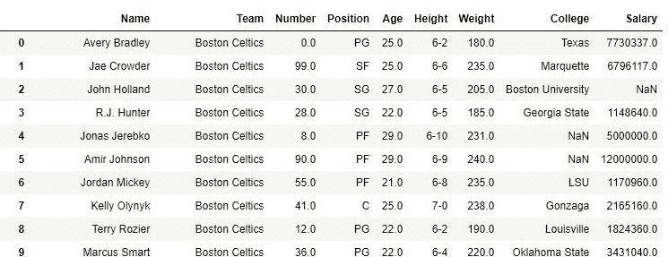
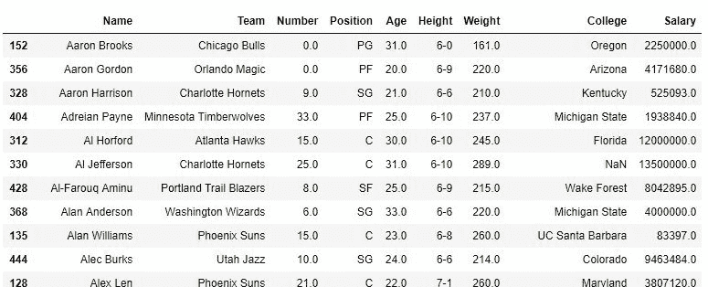
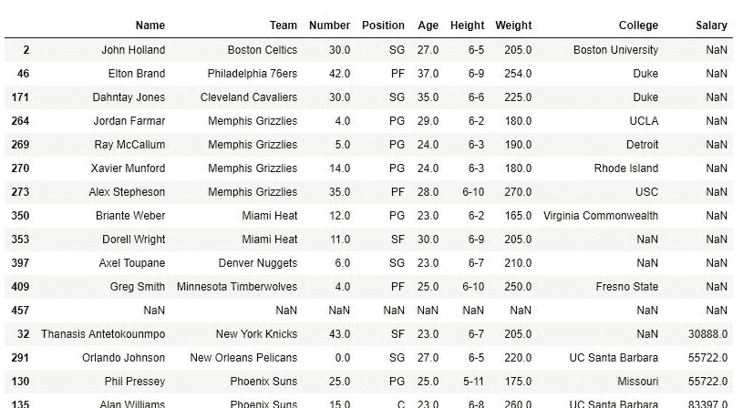

# Python | Pandas data frame . sort _ values()| Set-1

> 原文:[https://www . geesforgeks . org/python-pandas-data frame-sort _ values-set-1/](https://www.geeksforgeeks.org/python-pandas-dataframe-sort_values-set-1/)

Python 是进行数据分析的优秀语言，主要是因为以数据为中心的 Python 包的奇妙生态系统。**熊猫**就是其中的一个包，让导入和分析数据变得容易多了。
Pandas sort_values()函数按照传递列的升序或降序对数据框进行排序。它不同于排序的 Python 函数，因为它不能对数据框进行排序，也不能选择特定的列。
我们来讨论一下 **Dataframe.sort_values()** 单参数排序:
**语法:**

> DataFrame.sort_values(by，axis=0，升序=True，inplace=False，kind='quicksort '，na_position='last ')

除了“by”参数外，每个参数都有一些默认值。
**参数:**

> **依据:**单个/数据框排序依据的列名列表。
> **轴:**行为 0 或“索引”，列为 1 或“列”。
> **升序:**布尔值，如果为真，则按升序对数据框进行排序。
> **在位:**布尔值。如果为真，则对传递的数据框本身进行更改。
> **种类:**字符串，可以有三个输入(“quicksort”、“mergesort”或“heapsort”)算法用于对数据框进行排序。
> **na_position:** 取两个字符串输入‘last’或‘first’来设置 Null 值的位置。默认值为“最后”。

**返回类型:**

> 返回与函数调用方数据框具有相同维度的排序数据框。

有关代码中使用的 CSV 文件的链接，请单击此处的[。](https://media.geeksforgeeks.org/wp-content/uploads/nba.csv)
**示例#1:** 按名称排序
在以下示例中，从 csv 文件中制作一个数据框，数据框按玩家姓名的升序排序。
**排序前-**

## 计算机编程语言

```py
# importing pandas package
import pandas as pd

# making data frame from csv file
data = pd.read_csv("nba.csv")

# display
data
```

**输出:**



**整理后-**

## 计算机编程语言

```py
# importing pandas package
import pandas as pd

# making data frame from csv file
data = pd.read_csv("nba.csv")

# sorting data frame by name
data.sort_values("Name", axis = 0, ascending = True,
                 inplace = True, na_position ='last')

# display
data
```

如图所示，因为数据框是按名称排序的，所以索引列现在很混乱。
**输出:**



**例 2:** 改变空值的位置
在给定的数据中，不同的列中有很多空值，默认放在最后。在本例中，数据框按照“薪资”列排序，空值保留在顶部。

## 计算机编程语言

```py
# importing pandas package
import pandas as pd

# making data frame from csv file
data = pd.read_csv("nba.csv")

# sorting data frame by name
data.sort_values("Salary", axis = 0, ascending = True,
                 inplace = True, na_position ='first')

data
# display
```

如输出图像所示，NaN 值位于顶部，其后是“薪资”的排序值。
**输出:**

