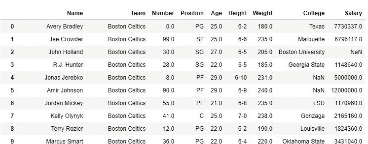
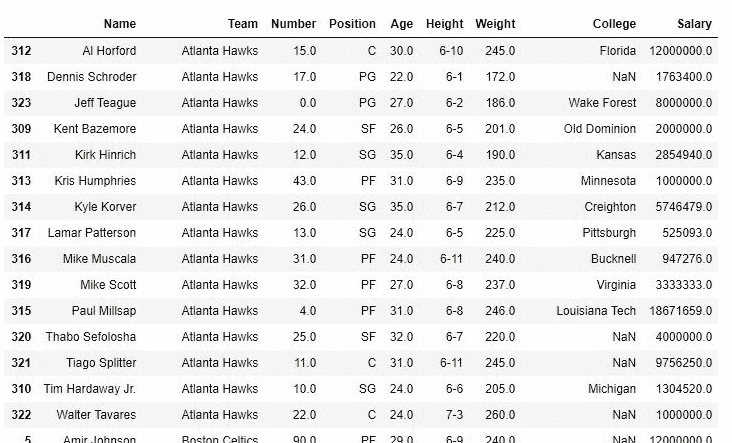
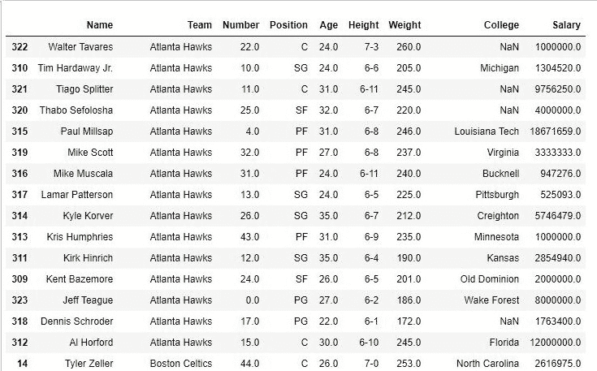
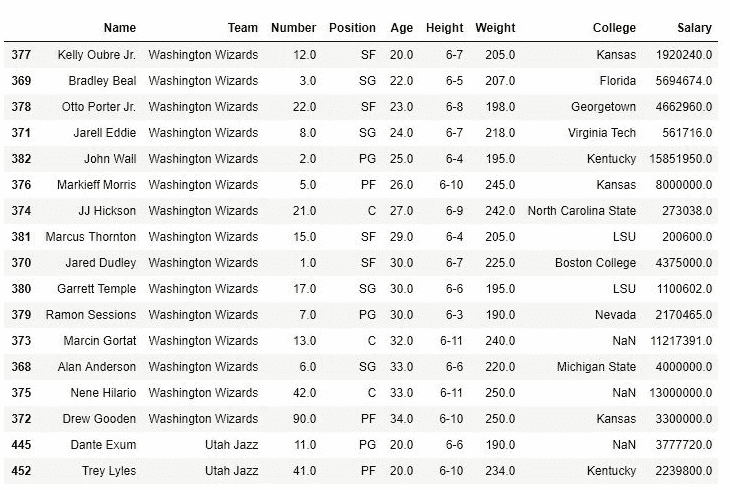

# Python | Pandas data frame . sort _ values()| Set-2

> 原文:[https://www . geesforgeks . org/python-pandas-data frame-sort _ values-set-2/](https://www.geeksforgeeks.org/python-pandas-dataframe-sort_values-set-2/)

先决条件:[熊猫数据帧. sort_values() | Set-1](https://www.geeksforgeeks.org/python-pandas-dataframe-sort_values-set-1/)

Python 是进行数据分析的优秀语言，主要是因为以数据为中心的 Python 包的奇妙生态系统。**熊猫**就是其中的一个包，让导入和分析数据变得容易多了。

熊猫`sort_values()` 函数按照传递列的升序或降序对数据帧进行排序。它不同于排序的 Python 函数，因为它不能对数据框进行排序，也不能选择特定的列。

我们来讨论一下`**Dataframe.sort_values()**` **多参数排序**:

**语法:**

> DataFrame.sort_values(by，axis=0，升序=True，inplace=False，kind='quicksort '，na_position='last ')

有关代码中使用的 CSV 文件的链接，请单击此处的[。](https://media.geeksforgeeks.org/wp-content/uploads/nba.csv)

**示例#1:** 按姓名和团队排序
在以下示例中，数据框由 csv 文件构成，数据框按团队升序排序，在每个团队中，姓名也按升序排序。

**分类前–**

```py
#importing pandas package
import pandas as pd

#making data frame from csv file
data=pd.read_csv("nba.csv")

#sorting data frame by Team and then By names
data.sort_values(["Team", "Name"], axis=0,
                 ascending=True, inplace=True)

#display
data
```

**输出:**


**排序后–**

```py
#importing pandas package
import pandas as pd

#making data frame from csv file
data=pd.read_csv("nba.csv")

#sorting data frame by Team and then By names
data.sort_values(["Team", "Name"], axis=0,
                 ascending=True, inplace=True)

#display
data
```

如图所示，团队首先按升序排序，然后每个团队名称的名称按升序排序。



**例 2:** 将列表传递给升序参数

如上面的示例所示，通过将列表传递给“by”参数，可以针对多列对数据框进行排序。我们还可以向“升序”参数传递一个列表，告诉熊猫该如何对哪一列进行排序。
“升序”参数中布尔型的索引应与“by”参数中列名的索引相同。

```py
#importing pandas package
import pandas as pd

#making data frame from csv file
data=pd.read_csv("nba.csv")

#sorting data frame by Team and then By names
data.sort_values(["Team", "Name"], axis=0,
                 ascending=[True,False], inplace=True)

#display
data
```

如下图所示，数据框按团队名称升序排序，对于每个团队名称，名称按降序排序。



**示例#3:** 使用 3 列排序

在以下示例中，同一数据框按团队名称排序。对于每个团队，数据框按年龄排序，对于每个相同的年龄，数据框按身高排序。本示例将解释多参数排序在数据框中是如何工作的。

```py
#importing pandas package
import pandas as pd

#making data frame from csv file
data=pd.read_csv("nba.csv")

#sorting data frame by Team, age and height
data.sort_values(["Team", "Age", "Height"], axis=0,
                 ascending=[False,True,False],
inplace=True)

#display
data
```

如图所示，首先对团队名称进行排序，然后是年龄，对于每个年龄，对身高进行排序。在“华盛顿奇才”队中，有 3 名 30 岁的球员。这 3 个人按照身高升序排列。
