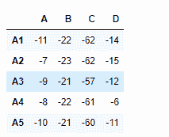
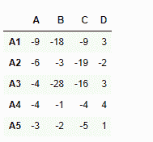

# Python | Pandas data frame . sub()

> 原文:[https://www.geeksforgeeks.org/python-pandas-dataframe-sub/](https://www.geeksforgeeks.org/python-pandas-dataframe-sub/)

Python 是进行数据分析的优秀语言，主要是因为以数据为中心的 python 包的奇妙生态系统。 ***【熊猫】*** 就是其中一个包，让导入和分析数据变得容易多了。
熊猫**data frame sub()**函数用于计算数据帧和其他元素的减法。该功能本质上与 data frame-other 相同，但支持替换其中一个输入中缺失的数据。

> **语法:**DataFrame sub(其他，轴='columns '，level=None，fill_value=None)
> **参数:**
> **其他:** Series，data frame，或常量
> **轴:**对于 Series 输入，轴要匹配
> **级别上的 Series 索引:**跨级别广播，匹配传递的 MultiIndex 级别上的索引值
> **fill_value :** 填充现有缺失如果两个相应数据框位置的数据都丢失，结果也将丢失。
> **返回:**结果:数据框

**示例#1:** 使用 sub()函数将数据帧的每个元素与系列中相应的元素相减。

## 蟒蛇 3

```py
# importing pandas as pd
import pandas as pd

# Creating the dataframe
df = pd.DataFrame({"A":[1, 5, 3, 4, 2],
                   "B":[3, 2, 4, 3, 4],
                   "C":[2, 2, 7, 3, 4],
                   "D":[4, 3, 6, 12, 7]},
                   index =["A1", "A2", "A3", "A4", "A5"])

# Print the dataframe
df
```


让我们创建这个系列

## 蟒蛇 3

```py
# importing pandas as pd
import pandas as pd

# Create the series
sr = pd.Series([12, 25, 64, 18], index =["A", "B", "C", "D"])

# Print the series
sr
```


让我们使用 dataframe.sub()函数进行减法运算。

## 蟒蛇 3

```py
# equivalent to df - sr
df.sub(sr, axis = 1)
```

**输出:**



**示例#2:** 使用 sub()函数将数据帧中的每个元素与其他数据帧中的相应元素相减

## 蟒蛇 3

```py
# importing pandas as pd
import pandas as pd

# Creating the first dataframe
df1 = pd.DataFrame({"A":[1, 5, 3, 4, 2],
                    "B":[3, 2, 4, 3, 4],
                    "C":[2, 2, 7, 3, 4],
                    "D":[4, 3, 6, 12, 7]},
                    index =["A1", "A2", "A3", "A4", "A5"])

# Creating the second dataframe
df2 = pd.DataFrame({"A":[10, 11, 7, 8, 5],
                    "B":[21, 5, 32, 4, 6],
                    "C":[11, 21, 23, 7, 9],
                    "D":[1, 5, 3, 8, 6]},
                    index =["A1", "A2", "A3", "A4", "A5"])

# subtract df2 from df1
df1.sub(df2)
```

**输出:**



请注意，数据帧 df1 的每个元素都已被 df2 中的相应元素减去。