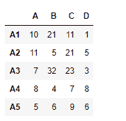
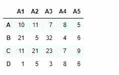
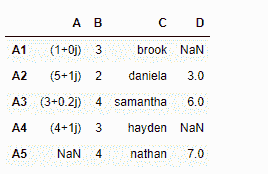
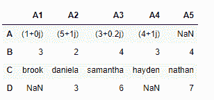

# Python | Pandas data frame . swapaxes()

> 原文:[https://www . geesforgeks . org/python-pandas-data frame-swapaxes/](https://www.geeksforgeeks.org/python-pandas-dataframe-swapaxes/)

Python 是进行数据分析的优秀语言，主要是因为以数据为中心的 python 包的奇妙生态系统。 ***【熊猫】*** 就是其中一个包，让导入和分析数据变得容易多了。

熊猫 `**dataframe.swapaxes()**`功能适当互换坐标轴和交换数值坐标轴。该函数采用要交换的轴的名称作为参数。基于轴，它也相应地改变数据。

> **语法:**数据帧交换(axis1，axis2，copy=True)
> 
> **参数:**
> **轴 1 :** 第一轴名称{ *弦* }
> **轴 2 :** 第二轴名称{ *弦*
> 
> **返回:** y:与输入相同

**示例#1:** 使用`swapaxes()`功能交换数据框的轴。

```py
# importing pandas as pd
import pandas as pd

# Creating the dataframe 
df = pd.DataFrame({"A":[10, 11, 7, 8, 5],
                   "B":[21, 5, 32, 4, 6],
                   "C":[11, 21, 23, 7, 9],
                   "D":[1, 5, 3, 8, 6]}, 
                   index =["A1", "A2", "A3", "A4", "A5"])

# Print the dataframe
df
```



```py
# interchange the index and columns axis
df.swapaxes("index", "columns")
```

**输出:**


**示例 2:** 使用`swapaxes()`功能相互交换索引轴和列轴。数据框缺少一些值。

```py
# importing pandas as pd
import pandas as pd

# Creating the dataframe 
df = pd.DataFrame({"A":[1, 5 + 1j, 3+.2j, 4 + 1j, None],
                   "B":[3, 2, 4, 3, 4],
                   "C":["brook", "daniela", "samantha", "hayden", "nathan"],
                   "D":[None, 3, 6, None, 7]},
                   index =["A1", "A2", "A3", "A4", "A5"])

# Print the dataframe
df
```



```py
# interchange the columns and index axis

df.swapaxes("index", "columns")
```

**输出:**
