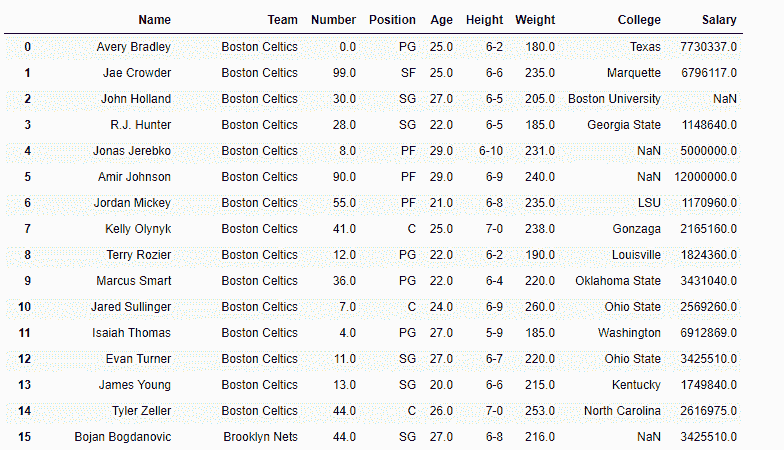
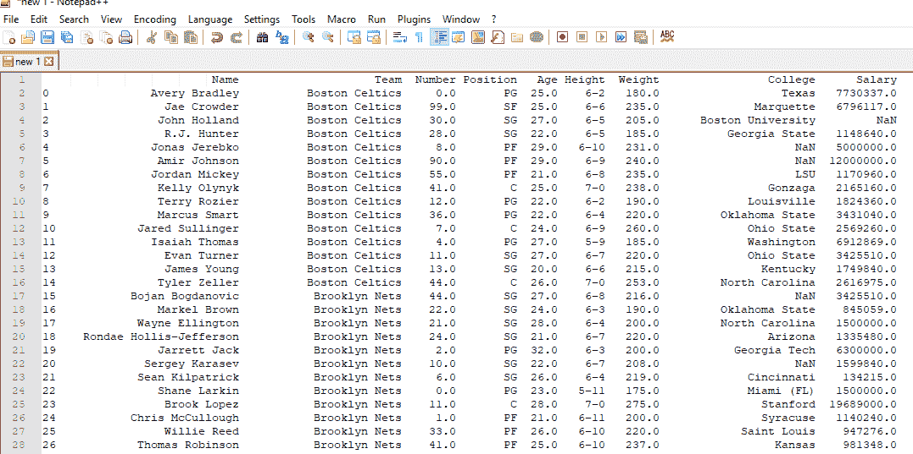
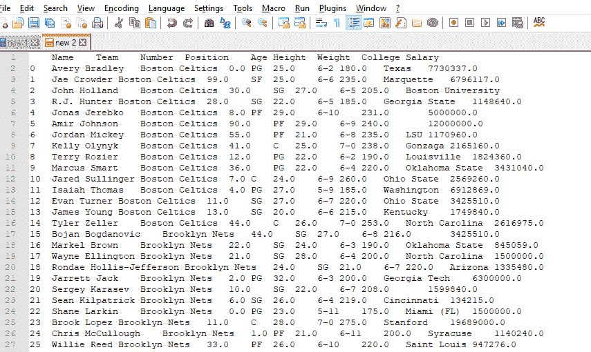

# Python | Pandas data frame . to _ clipboard()

> 原文:[https://www . geesforgeks . org/python-pandas-data frame-to _ clipboard/](https://www.geeksforgeeks.org/python-pandas-dataframe-to_clipboard/)

Python 是进行数据分析的优秀语言，主要是因为以数据为中心的 python 包的奇妙生态系统。 ***【熊猫】*** 就是其中一个包，让导入和分析数据变得容易多了。

熊猫 `**dataframe.to_clipboard()**`功能复制对象到系统剪贴板。该函数将对象的文本表示写入系统剪贴板。这可以很容易地粘贴到 excel 或记事本++。

> **语法:**data frame . to _ clipboard(excel = True，sep=None，**kwargs)
> 
> **参数:**
> **excel :** True，使用提供的分隔符，以 csv 格式书写，便于粘贴到 excel 中。False，将对象的字符串表示形式写入剪贴板。
> **sep :** 字段分隔符。
> ****kwargs :** 这些参数将被传递给 DataFrame.to_csv。

**注意:**要链接到代码中使用的 CSV 文件，请点击此处

**示例#1:** 使用`to_clipboard()`功能将对象以非 excel 格式复制到剪贴板。

```py
# importing pandas as pd
import pandas as pd

# Creating the dataframe 
df = pd.read_csv('nba.csv')

# Print the dataframe
df
```

**输出:**


现在我们将以非 excel 格式将此对象复制到剪贴板。

```py
# copy to clipboard
df.to_clipboard(excel = False, sep = ', ')
```

**输出:**

我们已经简单地粘贴了，在执行了前面的命令后被复制到剪贴板的内容。使用的软件是“记事本++”。

**示例 2:** 使用`to_clipboard()`功能将对象以 excel 格式复制到剪贴板。

```py
# importing pandas as pd
import pandas as pd

# Creating the dataframe 
df = pd.read_csv('nba.csv')

# Print the dataframe
df
```

**输出:**


现在，我们将以 excel 格式将此对象复制到剪贴板。

```py
# copy to clipboard
df.to_clipboard(excel = True)
```

**输出:**
