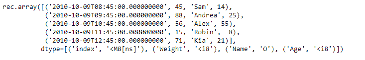
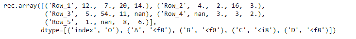

# Python | Pandas data frame . to _ records

> 原文:[https://www . geesforgeks . org/python-pandas-data frame-to _ records/](https://www.geeksforgeeks.org/python-pandas-dataframe-to_records/)

Pandas DataFrame 是一个二维可变大小、潜在异构的表格数据结构，带有标记轴(行和列)。算术运算在行标签和列标签上对齐。它可以被认为是系列对象的类似字典的容器。这是熊猫的主要数据结构。

熊猫 `**DataFrame.to_records()**`函数将数据帧转换为数字记录数组。如果需要，索引将作为记录数组的第一个字段。

> **语法:**data frame . to _ records(index = True，convert _ datetime64 =无，column _ dtypes =无，index _ dtypes =无)
> 
> **参数:**
> **索引:** bool，默认 True
> **convert _ datetime 64:**如果是 DatetimeIndex，是否将索引转换为 datetime.datetime。
> **column _ dttypes:**如果是字符串或类型，则数据类型存储所有列
> **index _ dttypes:**如果是字符串或类型，则数据类型存储所有索引级别
> 
> **返回:** numpy.recarray

**示例#1:** 使用`DataFrame.to_records()`函数将给定的数据帧转换为 numpy 记录数组。

```
# importing pandas as pd
import pandas as pd

# Creating the DataFrame
df = pd.DataFrame({'Weight':[45, 88, 56, 15, 71],
                   'Name':['Sam', 'Andrea', 'Alex', 'Robin', 'Kia'],
                   'Age':[14, 25, 55, 8, 21]})

# Create the index
index_ = pd.date_range('2010-10-09 08:45', periods = 5, freq ='H')

# Set the index
df.index = index_

# Print the DataFrame
print(df)
```

**输出:**


现在我们将使用`DataFrame.to_records()`函数将给定的数据帧转换为 numpy 记录数组表示。

```
# convert to numpy record array
result = df.to_records()

# Print the result
print(result)
```

**输出:**

正如我们在输出中看到的，`DataFrame.to_records()`函数已经成功地将给定的数据帧转换为 numpy 记录数组表示。

**示例 2:** 使用`DataFrame.to_records()`函数将给定的数据帧转换为 numpy 记录数组。

```
# importing pandas as pd
import pandas as pd

# Creating the DataFrame
df = pd.DataFrame({"A":[12, 4, 5, None, 1], 
                   "B":[7, 2, 54, 3, None], 
                   "C":[20, 16, 11, 3, 8], 
                   "D":[14, 3, None, 2, 6]}) 

# Create the index
index_ = ['Row_1', 'Row_2', 'Row_3', 'Row_4', 'Row_5']

# Set the index
df.index = index_

# Print the DataFrame
print(df)
```

**输出:**


现在我们将使用`DataFrame.to_records()`函数将给定的数据帧转换为 numpy 记录数组表示。

```
# convert to numpy record array
result = df.to_records()

# Print the result
print(result)
```

**输出:**

正如我们在输出中看到的，`DataFrame.to_records()`函数已经成功地将给定的数据帧转换为 numpy 记录数组表示。