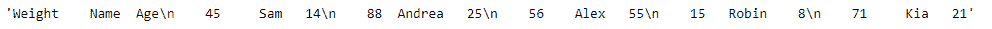
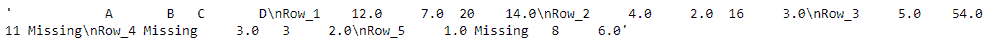

# Python | Pandas data frame . to _ string

> 原文:[https://www . geesforgeks . org/python-pandas-data frame-to _ string/](https://www.geeksforgeeks.org/python-pandas-dataframe-to_string/)

Pandas DataFrame 是一个二维可变大小、潜在异构的表格数据结构，带有标记轴(行和列)。算术运算在行标签和列标签上对齐。它可以被认为是系列对象的类似字典的容器。这是熊猫的主要数据结构。

熊猫 `**DataFrame.to_string()**`函数将数据帧渲染成控制台友好的表格输出。

> **语法:**data frame . to _ string(buf = None，col_space=None，header=True，index=True，na_rep='NaN '，formatters=None，float_format=None，sparsify=None，index _ names = True，justify = None，max_rows=None，max_cols=None，show_dimensions=False，decimal= ' '，线宽=无)
> 
> **参数:**
> **buf :** 缓冲区写入。
> **列:**要写入的列的子集。默认情况下写入所有列。
> **col_space :** 每列的最小宽度。
> **表头:**写出列名。如果给出了字符串列表，则假定它是列名的别名。
> **索引:**是否打印索引(行)标签。
> **na_rep :** 要使用的 NAN 的字符串表示。
> **格式化程序:**格式化程序通过位置或名称应用于列的元素。
> **float _ format:**Formatter 函数应用于列元素(如果它们是 float)。此函数的结果必须是 unicode 字符串。
> **稀疏化:**对于具有分层索引的数据帧，设置为假，以打印每行的每个多索引键。
> **索引名称:**打印索引的名称。
> **最大行数:**控制台中显示的最大行数。
> **max_cols :** 控制台中显示的最大列数。
> **show_dimensions :** 显示数据框维度(行数乘以列数)。
> **十进制:**在欧洲被认为是十进制分隔符的字符，例如“，”。
> **线宽:**宽度以字符换行。
> 
> **返回:**字符串(或 unicode，取决于数据和选项)

**示例#1:** 使用`DataFrame.to_string()`函数将给定的数据帧呈现为控制台友好的表格输出。不要在输出中包含索引标签。

```
# importing pandas as pd
import pandas as pd

# Creating the DataFrame
df = pd.DataFrame({'Weight':[45, 88, 56, 15, 71],
                   'Name':['Sam', 'Andrea', 'Alex', 'Robin', 'Kia'],
                   'Age':[14, 25, 55, 8, 21]})

# Create the index
index_ = pd.date_range('2010-10-09 08:45', periods = 5, freq ='H')

# Set the index
df.index = index_

# Print the DataFrame
print(df)
```

**输出:**


现在，我们将使用`DataFrame.to_string()`函数将给定的数据帧呈现为控制台友好的表格输出。

```
# print in tabular format
result = df.to_string(index = False)

# Print the result
print(result)
```

**输出:**

正如我们在输出中看到的，`DataFrame.to_string()`函数已经成功地将给定的数据帧渲染到控制台友好的表格输出中。

**示例#2:** 使用`DataFrame.to_string()`函数将给定的数据帧呈现为控制台友好的表格输出。用字符串“missing”表示给定数据帧中缺少的值。

```
# importing pandas as pd
import pandas as pd

# Creating the DataFrame
df = pd.DataFrame({"A":[12, 4, 5, None, 1], 
                   "B":[7, 2, 54, 3, None], 
                   "C":[20, 16, 11, 3, 8], 
                   "D":[14, 3, None, 2, 6]}) 

# Create the index
index_ = ['Row_1', 'Row_2', 'Row_3', 'Row_4', 'Row_5']

# Set the index
df.index = index_

# Print the DataFrame
print(df)
```

**输出:**


现在，我们将使用`DataFrame.to_string()`函数将给定的数据帧呈现为控制台友好的表格输出。

```
# print in tabular format
result = df.to_string(na_rep = 'Missing')

# Print the result
print(result)
```

**输出:**

正如我们在输出中看到的那样，`DataFrame.to_string()`函数已经成功地将给定的数据帧渲染为控制台友好的表格输出。