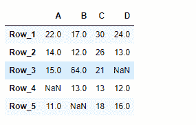
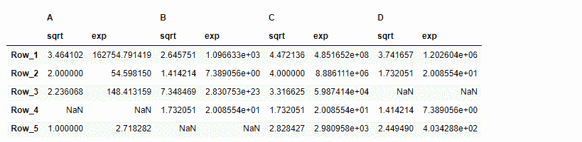

# Python | Pandas data frame . transform

> 原文:[https://www . geesforgeks . org/python-pandas-data frame-transform/](https://www.geeksforgeeks.org/python-pandas-dataframe-transform/)

Pandas DataFrame 是一个二维可变大小、潜在异构的表格数据结构，带有标记轴(行和列)。算术运算在行标签和列标签上对齐。它可以被认为是系列对象的类似字典的容器。这是熊猫的主要数据结构。

熊猫 `**DataFrame.transform()**`函数调用 func on self 产生一个具有转换值的数据帧，该数据帧具有与 self 相同的轴长。

> **语法:** DataFrame.transform(func，axis=0，*args，**kwargs)
> 
> **参数:**
> **函数:**用于转换数据的函数
> **轴:** {0 或“索引”，1 或“列”}，默认 0
> ***参数:**要传递给函数的位置参数。
> ****kwargs :** 要传递给 func 的关键字参数。
> 
> **返回:**数据帧

**示例#1 :** 使用`DataFrame.transform()`函数向数据框中的每个元素添加 10。

```
# importing pandas as pd
import pandas as pd

# Creating the DataFrame
df = pd.DataFrame({"A":[12, 4, 5, None, 1], 
                   "B":[7, 2, 54, 3, None], 
                   "C":[20, 16, 11, 3, 8], 
                   "D":[14, 3, None, 2, 6]}) 

# Create the index
index_ = ['Row_1', 'Row_2', 'Row_3', 'Row_4', 'Row_5']

# Set the index
df.index = index_

# Print the DataFrame
print(df)
```

**输出:**


现在我们将使用`DataFrame.transform()`函数为数据帧的每个元素添加 10。

```
# add 10 to each element of the dataframe
result = df.transform(func = lambda x : x + 10)

# Print the result
print(result)
```

**输出:**


正如我们在输出中看到的那样，`DataFrame.transform()`函数已经成功地为给定数据帧的每个元素添加了 10 个元素。

**示例#2 :** 使用`DataFrame.transform()`函数找到平方根和欧拉数上升到数据框每个元素的结果。

```
# importing pandas as pd
import pandas as pd

# Creating the DataFrame
df = pd.DataFrame({"A":[12, 4, 5, None, 1], 
                   "B":[7, 2, 54, 3, None], 
                   "C":[20, 16, 11, 3, 8], 
                   "D":[14, 3, None, 2, 6]}) 

# Create the index
index_ = ['Row_1', 'Row_2', 'Row_3', 'Row_4', 'Row_5']

# Set the index
df.index = index_

# Print the DataFrame
print(df)
```

**输出:**


现在我们将使用`DataFrame.transform()`函数来寻找平方根和欧拉数上升到数据帧每个元素的结果。

```
# pass a list of functions
result = df.transform(func = ['sqrt', 'exp'])

# Print the result
print(result)
```

**输出:**

正如我们在输出中看到的，`DataFrame.transform()`函数已经成功地对给定的数据帧执行了所需的操作。