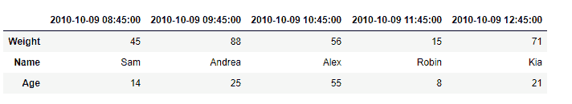
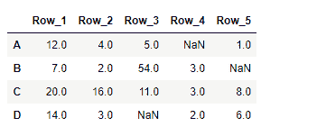

# Python | Pandas DataFrame .转置

> 原文:[https://www . geesforgeks . org/python-pandas-data frame-transpose/](https://www.geeksforgeeks.org/python-pandas-dataframe-transpose/)

Pandas DataFrame 是一个二维可变大小、潜在异构的表格数据结构，带有标记轴(行和列)。算术运算在行标签和列标签上对齐。它可以被认为是系列对象的类似字典的容器。这是熊猫的主要数据结构。

熊猫 `**DataFrame.transpose()**`函数转置数据帧的索引和列。它通过将行写成列来反映主对角线上的数据帧，反之亦然。

> **语法:**data frame . transponte(* args，**kwargs)
> 
> **参数:**
> **复制:**如果为真，则复制底层数据。否则(默认)，如果可能，不进行复制。
> ***args，**kwargs :** 附加关键字没有效果，但可能会被接受以与 numpy 兼容。
> 
> **返回:**转置的数据帧

**示例#1:** 使用`DataFrame.transpose()`函数查找给定数据帧的转置。

```
# importing pandas as pd
import pandas as pd

# Creating the DataFrame
df = pd.DataFrame({'Weight':[45, 88, 56, 15, 71],
                   'Name':['Sam', 'Andrea', 'Alex', 'Robin', 'Kia'],
                   'Age':[14, 25, 55, 8, 21]})

# Create the index
index_ = pd.date_range('2010-10-09 08:45', periods = 5, freq ='H')

# Set the index
df.index = index_

# Print the DataFrame
print(df)
```

**输出:**


现在我们将使用`DataFrame.transpose()`函数找到给定数据帧的转置。

```
# return the transpose
result = df.transpose()

# Print the result
print(result)
```

**输出:**


正如我们在输出中看到的那样，`DataFrame.transpose()`函数已经成功地返回了给定数据帧的转置。

**示例 2:** 使用`DataFrame.transpose()`函数查找给定数据帧的转置。

```
# importing pandas as pd
import pandas as pd

# Creating the DataFrame
df = pd.DataFrame({"A":[12, 4, 5, None, 1], 
                   "B":[7, 2, 54, 3, None], 
                   "C":[20, 16, 11, 3, 8], 
                   "D":[14, 3, None, 2, 6]}) 

# Create the index
index_ = ['Row_1', 'Row_2', 'Row_3', 'Row_4', 'Row_5']

# Set the index
df.index = index_

# Print the DataFrame
print(df)
```

**输出:**


现在我们将使用`DataFrame.transpose()`函数找到给定数据帧的转置。

```
# return the transpose
result = df.transpose()

# Print the result
print(result)
```

**输出:**

正如我们在输出中看到的，`DataFrame.transpose()`函数已经成功返回给定数据帧的转置。