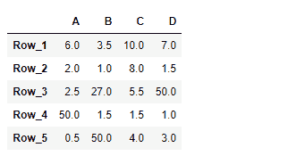
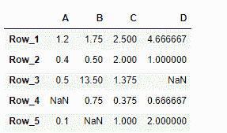

# python | pandas data frame . true div

> 原文:[https://www . geesforgeks . org/python-pandas-data frame-truediv/](https://www.geeksforgeeks.org/python-pandas-dataframe-truediv/)

Pandas DataFrame 是一个二维可变大小、潜在异构的表格数据结构，带有标记轴(行和列)。算术运算在行标签和列标签上对齐。它可以被认为是系列对象的类似字典的容器。这是熊猫的主要数据结构。

熊猫 `**DataFrame.truediv()**`功能执行数据帧和其他元素的浮动分割。它相当于`dataframe / other`，但支持用 fill_value 替换其中一个输入中缺失的数据。

> **语法:** DataFrame.truediv(其他，轴= '列'，级别=无，fill _ value =无)
> 
> **参数:**
> **其他:**标量、序列、序列或数据帧
> **轴:** {0 或“索引”，1 或“列”}
> **级别:**跨级别广播，在传递的多索引级别上匹配索引值。
> **fill_value :** 填充现有的缺失(NaN)值，以及成功的数据框对齐所需的任何新元素。
> 
> **返回:**算术运算的结果。

**示例#1 :** 使用`DataFrame.truediv()`函数以标量元素方式对给定的数据帧进行分割。同时在所有缺失值的地方填入 100。

```py
# importing pandas as pd
import pandas as pd

# Creating the DataFrame
df = pd.DataFrame({"A":[12, 4, 5, None, 1], 
                   "B":[7, 2, 54, 3, None], 
                   "C":[20, 16, 11, 3, 8], 
                   "D":[14, 3, None, 2, 6]}) 

# Create the index
index_ = ['Row_1', 'Row_2', 'Row_3', 'Row_4', 'Row_5']

# Set the index
df.index = index_

# Print the DataFrame
print(df)
```

**输出:**


现在我们将使用`DataFrame.truediv()`函数对给定的数据帧按元素进行 2 分频。我们将在这个数据框中所有缺失值的地方填充 100。

```py
# divide by 2 element-wise
# fill 100 at the place of missing values
result = df.truediv(other = 2, fill_value = 100)

# Print the result
print(result)
```

**输出:**

正如我们在输出中看到的那样，`DataFrame.truediv()`函数已经成功地对给定的数据帧进行了标量分割。

**示例 2 :** 使用`DataFrame.truediv()`功能使用列表对给定的数据帧进行分割。

```py
# importing pandas as pd
import pandas as pd

# Creating the DataFrame
df = pd.DataFrame({"A":[12, 4, 5, None, 1], 
                   "B":[7, 2, 54, 3, None], 
                   "C":[20, 16, 11, 3, 8], 
                   "D":[14, 3, None, 2, 6]}) 

# Create the index
index_ = ['Row_1', 'Row_2', 'Row_3', 'Row_4', 'Row_5']

# Set the index
df.index = index_

# Print the DataFrame
print(df)
```

**输出:**


现在我们将使用`DataFrame.truediv()`函数使用列表对给定的数据帧进行分割。

```py
# divide using a list
# across the column axis
result = df.truediv(other = [10, 4, 8, 3], axis = 1)

# Print the result
print(result)
```

**输出:**



正如我们在输出中看到的那样，`DataFrame.truediv()`函数已经成功地执行了给定数据帧的列表分割。