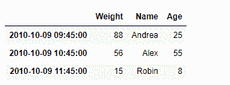
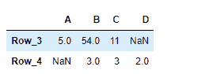

# Python |熊猫数据框.截断

> 原文:[https://www . geesforgeks . org/python-pandas-data frame-truncate/](https://www.geeksforgeeks.org/python-pandas-dataframe-truncate/)

Pandas DataFrame 是一个二维可变大小、潜在异构的表格数据结构，带有标记轴(行和列)。算术运算在行标签和列标签上对齐。它可以被认为是系列对象的类似字典的容器。这是熊猫的主要数据结构。

熊猫 `**DataFrame.truncate()**`函数用于在某个索引值前后截断一个序列或数据帧。这是基于高于或低于特定阈值的索引值的布尔索引的一种有用的简写。

> **语法:**数据帧。截断(前=无，后=无，轴=无，复制=真)
> 
> **参数:**
> **前:**截断该索引值前的所有行。
> **之后:**截断该索引值之后的所有行。
> **轴:**轴要截断。默认情况下截断索引(行)。
> **副本:**返回截断部分的副本。
> 
> **返回:**截断的序列或数据帧。

**示例#1:** 使用`DataFrame.truncate()`函数截断给定数据帧的传递标签前后的一些条目。

```
# importing pandas as pd
import pandas as pd

# Creating the DataFrame
df = pd.DataFrame({'Weight':[45, 88, 56, 15, 71],
                   'Name':['Sam', 'Andrea', 'Alex', 'Robin', 'Kia'],
                   'Age':[14, 25, 55, 8, 21]})

# Create the index
index_ = pd.date_range('2010-10-09 08:45', periods = 5, freq ='H')

# Set the index
df.index = index_

# Print the DataFrame
print(df)
```

**输出:**


现在我们将使用`DataFrame.truncate()`函数截断给定数据帧中“2010-10-09 09:45:00”之前和“2010-10-09 11:45:00”之后的条目。

```
# return the truncated dataframe
result = df.truncate(before = '2010-10-09 09:45:00', after = '2010-10-09 11:45:00')

# Print the result
print(result)
```

**输出:**



正如我们在输出中看到的那样，`DataFrame.truncate()`函数已经成功地截断了给定数据帧中传递的标签前后的条目。

**示例 2:** 使用`DataFrame.truncate()`函数截断给定数据帧的传递标签前后的一些条目。

```
# importing pandas as pd
import pandas as pd

# Creating the DataFrame
df = pd.DataFrame({"A":[12, 4, 5, None, 1], 
                   "B":[7, 2, 54, 3, None], 
                   "C":[20, 16, 11, 3, 8], 
                   "D":[14, 3, None, 2, 6]}) 

# Create the index
index_ = ['Row_1', 'Row_2', 'Row_3', 'Row_4', 'Row_5']

# Set the index
df.index = index_

# Print the DataFrame
print(df)
```

**输出:**


现在我们将使用`DataFrame.truncate()`函数来截断给定数据帧中“Row_3”之前和“Row_4”之后的条目。

```
# return the truncated dataframe
result = df.truncate(before = 'Row_3', after = 'Row_4')

# Print the result
print(result)
```

**输出:**



正如我们在输出中看到的那样，`DataFrame.truncate()`函数已经成功地截断了给定数据帧中传递的标签前后的条目。