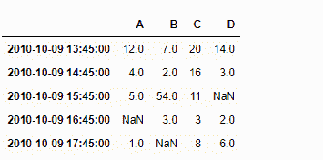
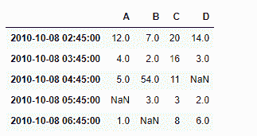

# python | pandas data frame . tshift

> 哎哎哎:# t0]https://www . geeksforgeeks . org/python 熊猫数据文件-tshift/

Pandas DataFrame 是一个二维可变大小、潜在异构的表格数据结构，带有标记轴(行和列)。算术运算在行标签和列标签上对齐。它可以被认为是系列对象的类似字典的容器。这是熊猫的主要数据结构。

熊猫 `**DataFrame.tshift()**`功能用于移动时间索引，如果给定数据帧中有索引，则使用索引的频率。

> **语法:**数据帧移位(周期=1，频率=无，轴=0)
> 
> **参数:**
> **周期:**要移动的周期数，可以是正的也可以是负的
> **频率:**增量用于从时间序列模块或时间规则(例如‘EOM’)
> **轴:**对应于包含索引的轴
> 
> **返回:**移位:NDFrame

**示例#1:** 使用`DataFrame.tshift()`函数将给定数据帧的基于日期时间的索引移动 5 小时。

```py
# importing pandas as pd
import pandas as pd

# Creating the DataFrame
df = pd.DataFrame({'Weight':[45, 88, 56, 15, 71],
                   'Name':['Sam', 'Andrea', 'Alex', 'Robin', 'Kia'],
                   'Age':[14, 25, 55, 8, 21]})

# Create the index
index_ = pd.date_range('2010-10-09 08:45', periods = 5, freq ='H')

# Set the index
df.index = index_

# Print the DataFrame
print(df)
```

**输出:**


现在我们将使用`DataFrame.tshift()`函数将给定数据帧的基于 Datetime 的索引移动 5 小时。我们将把‘5H’作为 freq 值传递给函数。

```py
# Shift by 5 hours
result = df.tshift(freq = '5H')

# Print the result
print(result)
```

**输出:**



正如我们在输出中看到的那样，`DataFrame.tshift()`函数已经成功地将给定数据帧的基于 Datetime 的索引移动了指定的频率。

**示例 2 :** 使用`DataFrame.tshift()`函数将给定数据帧的基于日期时间的索引移动-30 个周期。

```py
# importing pandas as pd
import pandas as pd

# Creating the DataFrame
df = pd.DataFrame({'Weight':[45, 88, 56, 15, 71],
                   'Name':['Sam', 'Andrea', 'Alex', 'Robin', 'Kia'],
                   'Age':[14, 25, 55, 8, 21]})

# Create the index
index_ = pd.date_range('2010-10-09 08:45', periods = 5, freq ='H')

# Set the index
df.index = index_

# Print the DataFrame
print(df)
```

**输出:**


现在我们将使用`DataFrame.tshift()`函数将给定数据帧的基于 Datetime 的索引移动-30 个周期。这将使同一频率的指数在过去移动 30 个周期。

```py
# Shift by -30 periods
result = df.tshift(periods = -30)

# Print the result
print(result)
```

**输出:**



正如我们在输出中看到的那样，`DataFrame.tshift()`函数已经成功地将给定数据帧的基于 Datetime 的索引移动了指定的周期。