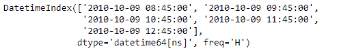
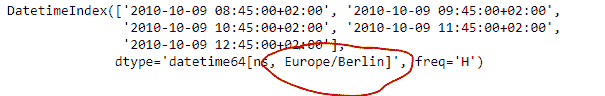
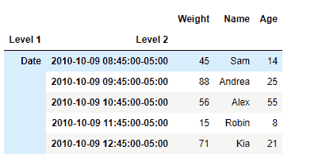
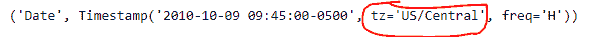

# Python | Pandas data frame . tz _ localize

> 原文:[https://www . geesforgeks . org/python-pandas-data frame-tz _ local/](https://www.geeksforgeeks.org/python-pandas-dataframe-tz_localize/)

Pandas DataFrame 是一个二维可变大小、潜在异构的表格数据结构，带有标记轴(行和列)。算术运算在行标签和列标签上对齐。它可以被认为是系列对象的类似字典的容器。这是熊猫的主要数据结构。

熊猫 `**DataFrame.tz_localize()**`功能将系列或数据帧的原始索引定位到目标时区。此操作将索引本地化。

> **语法:** DataFrame.tz_localize(tz，轴=0，级别=无，副本=真，不明确= '提升'，不存在= '提升')
> 
> **参数:**
> **tz :** 字符串或 pytz.timezone 对象
> **轴:**要本地化的轴
> **级别:**如果轴是一个 MultiIndex，则本地化一个特定级别。否则必须为无
> **副本:**同时复制底层数据
> **不明确:**当时钟因夏令时而向后移动时，可能会出现不明确的时间
> **不存在:**在时钟因夏令时而向前移动的特定时区中不存在不存在的时间
> 
> **返回:**与输入类型相同。

**示例#1:** 使用`DataFrame.tz_localize()`函数将数据帧的给定 tz-naive 索引定位到目标时区。

```py
# importing pandas as pd
import pandas as pd

# Creating the DataFrame
df = pd.DataFrame({'Weight':[45, 88, 56, 15, 71],
                   'Name':['Sam', 'Andrea', 'Alex', 'Robin', 'Kia'],
                   'Age':[14, 25, 55, 8, 21]})

# Create the index
index_ = pd.date_range('2010-10-09 08:45', periods = 5, freq ='H', tz = 'US / Central')

# Set the index
df.index = index_

# Print the DataFrame
print(df)
```

**输出:**


现在，我们将使用`DataFrame.tz_localize()`函数将数据框的给定 tz-naive 索引本地化为“欧洲/柏林”时区。

```py
# Let's find out the current timezone
# of the given dataframe
print(df.index)

# Let's localize the timezone of the
# dataframe index to 'Europe / Berlin'
df = df = df.tz_localize(tz = 'Europe / Berlin')

# Let's find out the current timezone
# of the given dataframe
print(df.index) 
```

**输出:**



正如我们在输出中看到的那样，`DataFrame.tz_localize()`函数已经成功地将给定数据帧的 tz-naive 索引本地化为目标时区。

**示例#2 :** 使用`DataFrame.tz_localize()`函数定位给定数据帧的原始索引。给定数据帧的索引是多索引。

```py
# importing pandas as pd
import pandas as pd

# Creating the DataFrame
df = pd.DataFrame({'Weight':[45, 88, 56, 15, 71],
                   'Name':['Sam', 'Andrea', 'Alex', 'Robin', 'Kia'],
                   'Age':[14, 25, 55, 8, 21]})

# Create the MultiIndex
index_ = pd.MultiIndex.from_product([['Date'], pd.date_range('2010-10-09 08:45', periods = 5, freq ='H')],
           names =['Level 1', 'Level 2'])

# Set the index
df.index = index_

# Print the DataFrame
print(df)
```

**输出:**


现在我们将使用`DataFrame.tz_localize()`函数将给定数据帧的初始索引定位到‘美国/中央’。

```py
# Let's find out the current timezone
# of the Level 1 of the given dataframe
print(df.index[1])

# Let's localize the timezone of the
# level 1 of the dataframe to 'US / Central'
df = df.tz_localize(tz = 'US / Central', level = 1)

# Let's find out the current timezone
# of the level 1 of the given dataframe
print(df.index[1]) 
```

**输出:**




正如我们在输出中看到的那样，`DataFrame.tz_localize()`函数已经成功地将给定数据帧的初始索引本地化为“美国/中央”。