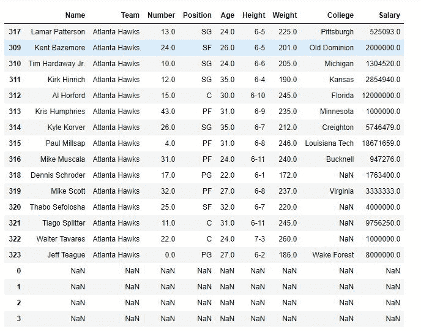
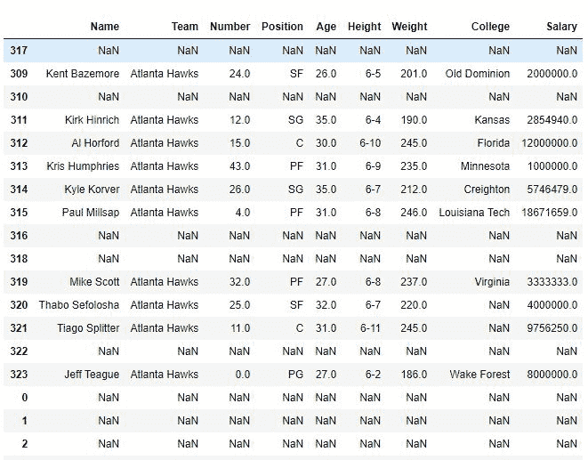

# Python | Pandas data frame . where()

> 原文:[https://www . geesforgeks . org/python-pandas-data frame-where/](https://www.geeksforgeeks.org/python-pandas-dataframe-where/)

Python 是进行数据分析的优秀语言，主要是因为以数据为中心的 python 包的奇妙生态系统。 ***【熊猫】*** 就是其中一个包，让导入和分析数据变得容易多了。

熊猫 **`where()`** 方法用于检查一个数据帧的一个或多个条件，并相应地返回结果。默认情况下，不满足条件的行用 NaN 值填充。

> `**Syntax:**`
> **data frame . where**(cond，other=nan，inplace=False，axis=None，level=None，errors='raise '，try_cast=False，raise_on_error=None)
> 
> `**Parameters:**`
> 
> **秒:**检查数据帧的一个或多个条件。
> **其他:**用用户定义的对象替换不满足条件的行，默认值为 NaN
> **替换为:**布尔值，如果为真则更改数据框本身
> **轴:**轴进行检查(行或列)

有关所用 CSV 文件的链接，请单击此处的[。](https://media.geeksforgeeks.org/wp-content/uploads/nba.csv)

**示例#1:** 单条件操作

在本例中，将显示具有特定团队名称的行，其余行将由 NaN 使用替换。where()方法。

```py
# importing pandas package
import pandas as pd

# making data frame from csv file
data = pd.read_csv("nba.csv")

# sorting dataframe
data.sort_values("Team", inplace = True)

# making boolean series for a team name
filter = data["Team"]=="Atlanta Hawks"

# filtering data
data.where(filter, inplace = True)

# display
data
```

**输出:**

如输出图像所示，没有 Team = Atlanta Hawks 的每一行都被 NaN 替换。


**示例#2:** 多条件操作

数据根据团队和年龄进行筛选。只会显示球队名称为“亚特兰大鹰队”的排和年龄在 24 岁以上的球员。

```py
# importing pandas package
import pandas as pd

# making data frame from csv file
data = pd.read_csv("nba.csv")

# sorting dataframe
data.sort_values("Team", inplace = True)

# making boolean series for a team name
filter1 = data["Team"]=="Atlanta Hawks"

# making boolean series for age
filter2 = data["Age"]>24

# filtering data on basis of both filters
data.where(filter1 & filter2, inplace = True)

# display
data
```

**输出:**
如输出图所示，只显示队名为“亚特兰大老鹰”的排和年龄在 24 岁以上的球员。

