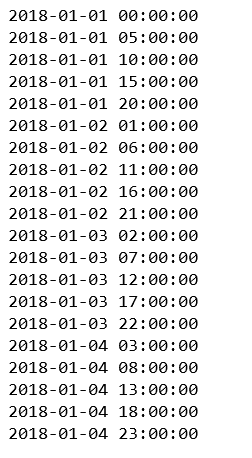
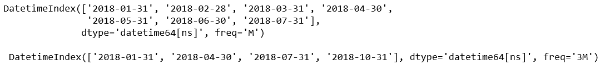
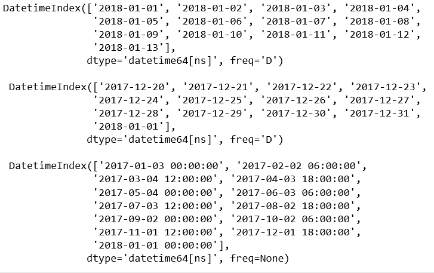
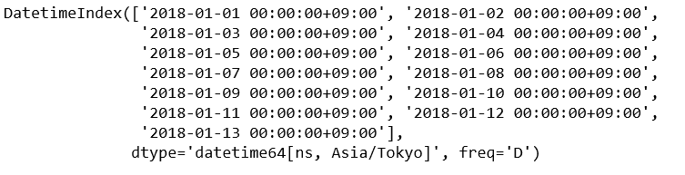

# 蟒蛇|熊猫. date_range()方法

> 原文:[https://www . geesforgeks . org/python-pandas-date _ range-method/](https://www.geeksforgeeks.org/python-pandas-date_range-method/)

Python 是进行数据分析的优秀语言，主要是因为以数据为中心的 python 包的奇妙生态系统。 ***【熊猫】*** 就是其中一个包，让导入和分析数据变得容易多了。

**`pandas.date_range()`** 是 Pandas 中的一个通用函数，用来返回固定频率的 DatetimeIndex。

> **语法:**pandas . date _ range(start = None，end=None，periods=None，freq=None，tz=None，normalize=False，name=None，closed=None，**kwargs)
> 
> **参数:**
> **开始:**向左绑定生成日期。
> **结束:**向右绑定生成日期。
> **期间:**要生成的期间数。
> **freq :** 频率串可以有倍数，例如‘5H’。有关频率别名的列表，请参见此处。
> **tz :** 用于返回本地化日期时间索引的时区名称。默认情况下，生成的日期时间索引是时区无关的。
> **归一化:**将开始/结束日期归一化到生成日期范围前的午夜。
> **名称:**结果日期时间索引的名称。
> **关闭:**使间隔相对于给定频率向“左”、“右”或两侧关闭(无，默认)。
> 
> **返回:**日期时间索引

**代码#1:**

```
# importing pandas as pd
import pandas as pd

per1 = pd.date_range(start ='1-1-2018', 
         end ='1-05-2018', freq ='5H')

for val in per1:
    print(val)
```

**输出:**


**代码#2:**

```
# importing pandas as pd
import pandas as pd

dRan1 = pd.date_range(start ='1-1-2018',
           end ='8-01-2018', freq ='M')

dRan2 = pd.date_range(start ='1-1-2018', 
         end ='11-01-2018', freq ='3M')

print(dRan1, '\n\n', dRan2)
```

**输出:**


**代码#3:**

```
# importing pandas as pd
import pandas as pd

# Specify start and periods, the number of periods (days).
dRan1 = pd.date_range(start ='1-1-2018', periods = 13)

# Specify end and periods, the number of periods (days).
dRan2 = pd.date_range(end ='1-1-2018', periods = 13)

# Specify start, end, and periods; the frequency 
# is generated automatically (linearly spaced).
dRan3 = pd.date_range(start ='01-03-2017', 
            end ='1-1-2018', periods = 13)

print(dRan1, "\n\n", dRan2, '\n\n', dRan3)
```

**输出:**


**代码#4:**

```
# importing pandas as pd
import pandas as pd

# Specify start and periods, the number of periods (days).
dRan1 = pd.date_range(start ='1-1-2018', 
       periods = 13, tz ='Asia / Tokyo')

dRan1
```

**输出:**
