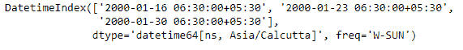
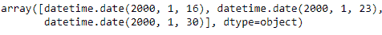
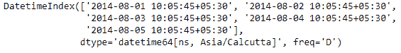
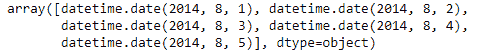

# Python |熊猫约会索引. date

> 哎哎哎:# t0]https://www . geeksforgeeks . org/python 熊猫约会索引-日期/

Python 是进行数据分析的优秀语言，主要是因为以数据为中心的 python 包的奇妙生态系统。 ***【熊猫】*** 就是其中一个包，让导入和分析数据变得容易多了。

熊猫 `**DatetimeIndex.date**`属性输出一个索引对象，该对象包含出现在 DatetimeIndex 对象的每个条目中的日期值。

> **语法：** 日期时间索引.日期
> 
> **返回:**python datetime . date 的 numpy 数组

**示例#1:** 使用`DatetimeIndex.date`属性查找 DatetimeIndex 对象的日期部分。

```py
# importing pandas as pd
import pandas as pd

# Create the DatetimeIndex
# Here 'W' represents Weekly frequency
didx = pd.DatetimeIndex(start ='2000-01-10 06:30', freq ='W', 
                            periods = 3, tz ='Asia/Calcutta')

# Print the DatetimeIndex
print(didx)
```

**输出:**


现在，我们希望找到 DatetimeIndex 对象中存在的所有日期值。

```py
# find all the date values present in the object
didx.date
```

**输出:**

正如我们在输出中看到的，该函数返回了一个 Index 对象，该对象包含 DatetimeIndex 对象的每个条目中存在的日期值。

**示例#2:** 使用`DatetimeIndex.date`属性查找 DatetimeIndex 对象的日期部分。

```py
# importing pandas as pd
import pandas as pd

# Create the DatetimeIndex
# Here 'D' represents Daily frequency
didx = pd.DatetimeIndex(start ='2014-08-01 10:05:45', freq ='D',
                               periods = 5, tz ='Asia/Calcutta')

# Print the DatetimeIndex
print(didx)
```

**输出:**



现在，我们希望找到 DatetimeIndex 对象中存在的所有日期值。

```py
# find all the date values present in the object
didx.date
```

**输出:**

正如我们在输出中看到的，该函数返回了一个 Index 对象，该对象包含 DatetimeIndex 对象的每个条目中存在的日期值。