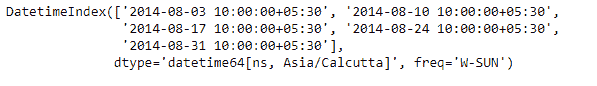
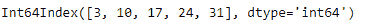
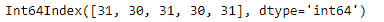

# Python |熊猫约会指数. day

> 哎哎哎:# t0]https://www . geeksforgeeks . org/python 熊猫-date index-day/

Python 是进行数据分析的优秀语言，主要是因为以数据为中心的 python 包的奇妙生态系统。 ***【熊猫】*** 就是其中一个包，让导入和分析数据变得容易多了。

熊猫 `**DatetimeIndex.day**`属性输出一个索引对象，该对象包含 DatetimeIndex 对象的每个条目中的日期。

> **语法：** 日期时间索引.day
> 
> **返回:**包含天数的指数。

**示例#1:** 使用`DatetimeIndex.day`属性查找 DatetimeIndex 对象中的天数。

```
# importing pandas as pd
import pandas as pd

# Create the DatetimeIndex
# Here the 'W' represents Weekly frequency
didx = pd.DatetimeIndex(start ='2014-08-01 10:00', freq ='W',
                            periods = 5, tz ='Asia/Calcutta')

# Print the DatetimeIndex
print(didx)
```

**输出:**


现在，我们希望找到 DatetimeIndex 对象中存在的所有日期值。

```
# find all the days present in the object
didx.day
```

**输出:**

正如我们在输出中看到的，该函数返回了一个 Index 对象，其中包含了 DatetimeIndex 对象中每个条目对应的天数值。

**示例#2:** 使用`DatetimeIndex.day`属性查找 DatetimeIndex 对象中存在的天数。

```
# importing pandas as pd
import pandas as pd

# Create the DatetimeIndex
# Here the 'M' represents Month end frequency
didx = pd.DatetimeIndex(start ='2014-08-01 10:00', freq ='M', 
                          periods = 5, tz ='Asia/Calcutta')

# Print the DatetimeIndex
print(didx)
```

**输出:**


现在，我们希望找到 DatetimeIndex 对象中存在的所有日期值。

```
# find all the months in the object
didx.day
```

**输出:**

正如我们在输出中看到的，函数返回了一个 Index 对象，其中包含了 DatetimeIndex 对象中每个条目对应的天数值。