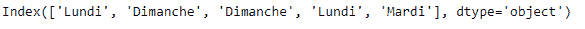

# python | pandas dateindex . day _ name()

> 原文:[https://www . geesforgeks . org/python-pandas-datetime index-day _ name/](https://www.geeksforgeeks.org/python-pandas-datetimeindex-day_name/)

Python 是进行数据分析的优秀语言，主要是因为以数据为中心的 python 包的奇妙生态系统。 ***【熊猫】*** 就是其中一个包，让导入和分析数据变得容易多了。

熊猫 `**DatetimeIndex.day_name()**`函数返回指定地区的日期时间索引的日期名称。默认区域设置为“无”，在这种情况下，将以英语返回名称。

> **语法：** DatetimeIndex.day_name（语言环境=无）
> 
> **参数:**
> **区域设置:**区域设置确定返回日期名称的语言
> 
> **返回:**日名称索引

**示例#1:** 使用`DatetimeIndex.day_name()`函数返回 DatetimeIndex 对象中每个条目的日期名称。返回法语地区的日期名称

```py
# importing pandas as pd
import pandas as pd

# Create the DatetimeIndex
# Here 'Q' represents quarterly frequency 
didx = pd.DatetimeIndex(start ='2018-11-15 09:45:10', freq ='Q', periods = 5)

# Print the DatetimeIndex
print(didx)
```

**输出:**


现在我们想要返回法语地区的日期名称。

```py
# return the names of the days in French
didx.day_name(locale ='French')
```

**输出:**

正如我们在输出中看到的，该函数返回了一个 Index 对象，其中包含法语中的日期名称。

让我们用英语返回日子的名称

```py
# return the names of the days in English
didx.day_name(locale ='English')
```

**输出:**


**示例#2:** 使用`DatetimeIndex.day_name()`函数返回 DatetimeIndex 对象中每个条目的日期名称。返回德语地区的日期名称

```py
# importing pandas as pd
import pandas as pd

# Create the DatetimeIndex
# Here 'M' represents monthly frequency 
didx = pd.DatetimeIndex(start ='2015-03-02', freq ='M', periods = 5)

# Print the DatetimeIndex
print(didx)
```

**输出:**


现在，我们想要返回德国地区的日期名称。

```py
# return the names of the days in German
didx.day_name(locale ='German')
```

**输出:**

正如我们在输出中看到的，该函数返回了一个 Index 对象，该对象包含德语区域中的日期名称。