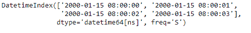
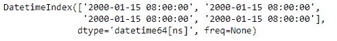
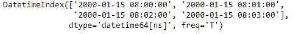
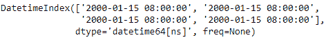

# python | pandas dateindex . floor()

> 哎哎哎:# t0]https://www . geeksforgeeks . org/python 熊猫-date index-floor/

Python 是进行数据分析的优秀语言，主要是因为以数据为中心的 python 包的奇妙生态系统。 ***【熊猫】*** 就是其中一个包，让导入和分析数据变得容易多了。

熊猫 `**DatetimeIndex.floor()**`功能将数据落地到指定频率。该函数以目标频率为输入。它返回一个新的日期时间索引对象。

> **语法:** DatetimeIndex.floor(freq)
> 
> **参数:**
> **频率:**频率等级为楼层指数。必须是固定频率，如“S”(秒)而不是“ME”(月末)。
> 
> **返回:**日期时间索引或时间增量索引的相同类型的索引，或序列具有相同索引的序列。

**示例#1:** 使用`DatetimeIndex.floor()`功能将 DatetimeIndex 对象的数据拖到指定的频率。

```py
# importing pandas as pd
import pandas as pd

# Create the DatetimeIndex
# Here 'S' represents secondly frequency 
didx = pd.DatetimeIndex(start ='2000-01-15 08:00', freq ='S', periods = 4)

# Print the DatetimeIndex
print(didx)
```

**输出:**


现在，我们希望将 DatetimeIndex 对象的第二个频率限制为分钟频率

```py
# convert to the passed frequency
# 'T' represents minute based frequency
didx.floor('T')
```

**输出:**


正如我们在输出中看到的，该函数将 DatetimeIndex 对象的值钻到了所需的频率。

**示例#2:** 使用`DatetimeIndex.floor()`函数将 DatetimeIndex 对象的数据拖到指定的频率。

```py
# importing pandas as pd
import pandas as pd

# Create the DatetimeIndex
# Here 'T' represents minutely frequency 
didx = pd.DatetimeIndex(start ='2000-01-15 08:00', freq ='T', periods = 4)

# Print the DatetimeIndex
print(didx)
```

**输出:**


现在，我们希望将 DatetimeIndex 对象基于分钟的频率限制为基于小时的频率

```py
# floor minute based frequency to hour based frequency
didx.floor('H')
```

**输出:**

正如我们在输出中看到的，该函数已经将 DatetimeIndex 对象的值钻到了所需的频率。