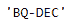
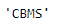

# Python |熊猫约会指数。freqstr

> 哎哎哎:# t0]https://www . geeksforgeeks . org/python 熊猫约会索引-freqstr/

Python 是进行数据分析的优秀语言，主要是因为以数据为中心的 python 包的奇妙生态系统。 ***【熊猫】*** 就是其中一个包，让导入和分析数据变得容易多了。

Pandas `**DatetimeIndex.freqstr**`属性如果在 DatetimeIndex 对象中设置，则以字符串形式返回频率对象。如果未设置频率，则返回无。

> **语法:** DatetimeIndex.freqstr
> 
> **返回:**频率对象为字符串

**示例#1:** 使用`DatetimeIndex.freqstr`属性将频率对象作为给定日期时间索引对象的字符串返回。

```
# importing pandas as pd
import pandas as pd

# Create the DatetimeIndex
# Here 'BQ' represents Business quarter frequency
didx = pd.DatetimeIndex(start ='2014-08-01 10:05:45', freq ='BQ',
                              periods = 5, tz ='Asia/Calcutta')

# Print the DatetimeIndex
print(didx)
```

**输出:**

现在我们要找到给定 DatetimeIndex 对象的频率字符串值。

```
# find the value of frequency object as string
didx.freqstr
```

**输出:**

正如我们在输出中看到的，函数已经为给定的 DatetimeIndex 对象返回了作为字符串的 frequency 对象。“BQ”代表业务季度，“DEC”表示从 12 月份开始。

**示例#2:** 使用`DatetimeIndex.freqstr`属性为给定的 DatetimeIndex 对象查找作为字符串的频率对象。

```
# importing pandas as pd
import pandas as pd

# Create the DatetimeIndex
# Here 'CBMS' represents custom business month start frequency
didx = pd.DatetimeIndex(start ='2000-01-10 06:30', freq ='CBMS',
                              periods = 5, tz ='Asia/Calcutta')

# Print the DatetimeIndex
print(didx)
```

**输出:**


现在，我们想要为给定的 DatetimeIndex 对象找到频率的字符串值。

```
# find the value of frequency object as string
didx.freqstr
```

**输出:**

正如我们在输出中看到的，函数已经为给定的 DatetimeIndex 对象返回了作为字符串的 frequency 对象。 *didx* DatetimeIndex 对象具有自定义的业务月开始频率。