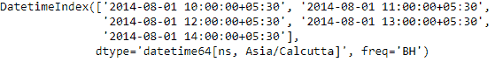
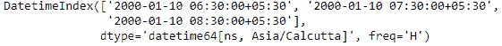
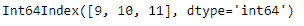

# Python |熊猫约会指标.小时

> 哎哎哎:# t0]https://www . geeksforgeeks . org/python-panda-dateindex-hour/

Python 是进行数据分析的优秀语言，主要是因为以数据为中心的 python 包的奇妙生态系统。 ***【熊猫】*** 就是其中一个包，让导入和分析数据变得容易多了。

熊猫 `**DatetimeIndex.hour**`属性输出一个索引对象，该对象包含出现在 DatetimeIndex 对象的每个条目中的小时值。

> **语法：** 日期时间索引.hour
> 
> **返回:**包含小时的指数。

**示例#1:** 使用`DatetimeIndex.hour`属性查找 DatetimeIndex 对象中的小时值。

```py
# importing pandas as pd
import pandas as pd

# Create the DatetimeIndex
# Here the 'BH' represents business hour frequency
didx = pd.DatetimeIndex(start ='2014-08-01 10:00', freq ='BH', 
                             periods = 5, tz ='Asia/Calcutta')

# Print the DatetimeIndex
print(didx)
```

**输出:**


现在，我们想要找到 DatetimeIndex 对象中存在的所有小时值。

```py
# find all the hour values present in the object
didx.hour
```

**输出:**

正如我们在输出中看到的，该函数返回了一个 Index 对象，该对象包含 DatetimeIndex 对象的每个条目中存在的小时值。

**示例#2:** 使用`DatetimeIndex.hour`属性查找 DatetimeIndex 对象中存在的小时值。

```py
# importing pandas as pd
import pandas as pd

# Create the DatetimeIndex
# Here the 'H' represents hourly frequency
didx = pd.DatetimeIndex(start ='2000-01-10 06:30', freq ='H', 
                            periods = 3, tz ='Asia/Calcutta')

# Print the DatetimeIndex
print(didx)
```

**输出:**

现在我们要找到 DatetimeIndex 对象中存在的所有小时值。

```py
# find all the hour values present in the object
didx.hour
```

**输出:**

正如我们在输出中看到的，该函数返回了一个 Index 对象，该对象包含 DatetimeIndex 对象的每个条目中存在的小时值。