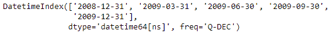
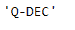
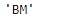

# 蟒蛇|熊猫日期时间索引.推断 _freq

> 原文:[https://www . geesforgeks . org/python-pandas-datetime index-explicated _ freq/](https://www.geeksforgeeks.org/python-pandas-datetimeindex-inferred_freq/)

Python 是进行数据分析的优秀语言，主要是因为以数据为中心的 python 包的奇妙生态系统。 ***【熊猫】*** 就是其中一个包，让导入和分析数据变得容易多了。

Pandas `**DatetimeIndex.inferred_freq**`属性试图返回一个表示频率猜测的字符串，由 infer _ freq 生成。对于函数不能自动检测日期时间索引频率的情况，它返回无。

> **语法:**datetime index . expected _ freq
> 
> **返回:**频率

**示例#1:** 使用`DatetimeIndex.inferred_freq`属性自动检测给定日期时间索引对象的频率。

```py
# importing pandas as pd
import pandas as pd

# Create the DatetimeIndex
didx = pd.date_range("2008-12-30", periods = 5, freq ='Q')

# Print the DatetimeIndex
print(didx)
```

**输出:**


现在，我们希望函数自动检测给定日期时间索引对象的频率。

```py
# find the frequency of the object.
didx.inferred_freq
```

**输出:**


正如我们在输出中看到的，该函数已经尝试自动检测给定 DatetimeIndex 对象的频率，并返回了从 12 月开始的四分之一类型频率。

**示例 2:** 使用`DatetimeIndex.inferred_freq`属性自动检测给定日期时间索引对象的频率。

```py
# importing pandas as pd
import pandas as pd

# Create the DatetimeIndex
didx = pd.DatetimeIndex(start ='2000-01-31 06:30', freq ='BM', 
                           periods = 5, tz ='Asia/Calcutta')

# Print the DatetimeIndex
print(didx)
```

**输出:**


现在，我们希望函数自动检测给定日期时间索引对象的频率。

```py
# find the frequency of the object.
didx.inferred_freq
```

**输出:**

正如我们在输出中看到的，函数已经尝试自动检测给定 DatetimeIndex 对象的频率，并且已经返回‘BM’(营业月结束)频率。