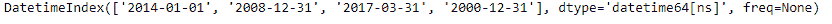
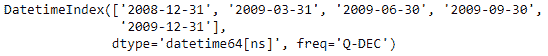
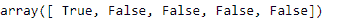

# Python | Pandas datetime index . is _ leap _ year

> 原文:[https://www . geesforgeks . org/python-pandas-datetime index-is _ leap _ year/](https://www.geeksforgeeks.org/python-pandas-datetimeindex-is_leap_year/)

Python 是进行数据分析的优秀语言，主要是因为以数据为中心的 python 包的奇妙生态系统。 ***【熊猫】*** 就是其中一个包，让导入和分析数据变得容易多了。

如果日期属于闰年，熊猫 `**DatetimeIndex.is_leap_year**`属性返回一个布尔指示符。闰年是一年，有 366 天(而不是 365 天)，包括 2 月 29 日作为闰日。闰年是四的倍数，但被 100 整除但不能被 400 整除的年份除外。

> **语法:** DatetimeIndex.is_leap_year
> 
> **返回:**包含逻辑值的 numpy 数组。

**示例#1:** 使用`DatetimeIndex.is_leap_year`属性检查 DatetimeIndex 对象中的日期是否属于闰年。

```
# importing pandas as pd
import pandas as pd

# Create the DatetimeIndex
didx = pd.DatetimeIndex(['2014-01-01', '2008-12-31', '2017-03-31', '2000-12-31'])

# Print the DatetimeIndex
print(didx)
```

**输出:**


现在我们想知道给定的 DatetimeIndex 对象中包含的日期是否属于闰年。

```
# find if the dates belong to leap year
didx.is_leap_year
```

**输出:**

正如我们在输出中看到的，该函数返回了一个 numpy 数组，其中包含 DatetimeIndex 对象的每个条目的逻辑值。`True`值表示对应日期属于闰年，`False`值表示对应日期不属于闰年。

**示例#2:** 使用`DatetimeIndex.is_leap_year`属性检查 DatetimeIndex 对象中的日期是否属于闰年。

```
# importing pandas as pd
import pandas as pd

# Create the DatetimeIndex
didx = pd.date_range("2008-12-30", periods = 5, freq ='Q')

# Print the DatetimeIndex
print(didx)
```

**输出:**


现在我们想知道给定的 DatetimeIndex 对象中包含的日期是否属于闰年。

```
# find if the dates belong to leap year
didx.is_leap_year
```

**输出:**

正如我们在输出中看到的，该函数返回了一个 numpy 数组，其中包含 DatetimeIndex 对象的每个条目的逻辑值。`True`值表示对应日期属于闰年，`False`值表示对应日期不属于闰年。