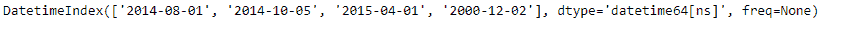
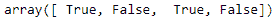
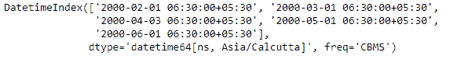
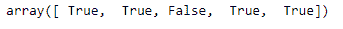

# Python | Pandas datetime index . is _ month _ start

> 原文:[https://www . geesforgeks . org/python-pandas-datetime index-is _ month _ start/](https://www.geeksforgeeks.org/python-pandas-datetimeindex-is_month_start/)

Python 是进行数据分析的优秀语言，主要是因为以数据为中心的 python 包的奇妙生态系统。 ***【熊猫】*** 就是其中一个包，让导入和分析数据变得容易多了。

Pandas `**DatetimeIndex.is_month_start**`属性返回一个 numpy 数组，该数组包含与 DatetimeIndex 对象中的每个条目相对应的逻辑值。如果日期是一个月的第一天，该值设置为`True`。否则该函数返回`False`，表示日期不是一个月的第一天。

> **语法:**datetime index . is _ month _ start
> 
> **返回:**包含逻辑值的 numpy 数组。

**示例#1:** 使用`DatetimeIndex.is_month_start`属性检查 DatetimeIndex 对象中出现的日期是否是一个月的第一天。

```
# importing pandas as pd
import pandas as pd

# Create the DatetimeIndex
didx = pd.DatetimeIndex(['2014-08-01', '2014-10-05',
                         '2015-04-01', '2000-12-02'])

# Print the DatetimeIndex
print(didx)
```

**输出:**


现在我们想知道给定 DatetimeIndex 对象中包含的日期是否是一个月的第一天。

```
# find if the days are the first day of the month.
didx.is_month_start
```

**输出:**

正如我们在输出中看到的，该函数返回了一个 numpy 数组，其中包含 DatetimeIndex 对象的每个条目的逻辑值。`True`值表示对应日期是当月的第一天，`False`值表示对应日期不是当月的第一天。

**示例#2:** 使用`DatetimeIndex.is_month_start`属性检查 DatetimeIndex 对象中出现的日期是否是一个月的第一天。

```
# importing pandas as pd
import pandas as pd

# Create the DatetimeIndex
didx = pd.DatetimeIndex(start ='2000-01-10 06:30', freq ='CBMS', 
                              periods = 5, tz ='Asia/Calcutta')

# Print the DatetimeIndex
print(didx)
```

**输出:**


现在我们想知道给定 DatetimeIndex 对象中包含的日期是否是一个月的第一天。

```
# find if the days are the first day of the month.
didx.is_month_start
```

**输出:**

正如我们在输出中看到的，该函数返回了一个 numpy 数组，其中包含 DatetimeIndex 对象的每个条目的逻辑值。`True`值表示对应日期是当月的第一天，`False`值表示对应日期不是当月的第一天。